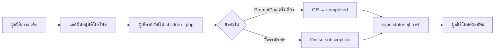
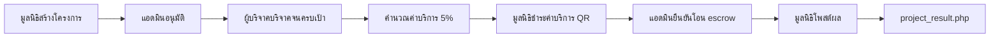
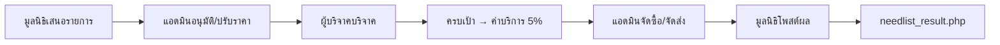

# คู่มือ Flow DrawDream — อ่านตามลำดับจนจบ

เอกสารสรุป **ไฟล์โค้ด + บทบาทสั้น** เรียงตามลำดับการทำงานจริงในระบบ (ไม่เรียง A–Z) รูปแบบเดียวกับตารางสารบัญใน [`includes-code-walkthrough.md`](includes-code-walkthrough.md)

| ต้องการ | ไปที่ |
|---------|--------|
| Server Requirement + ติดตั้ง/Config (ตอบอาจารย์) | [`server-requirement-and-installation.md`](server-requirement-and-installation.md) |
| โค้ดจริง + เลขบรรทัด + อธิบายยาว | [`drawdream-features-code-walkthrough.md`](drawdream-features-code-walkthrough.md) |
| สิ่งของ 8 ฟีเจอร์ย่อย | [`needlist-features-code-walkthrough.md`](needlist-features-code-walkthrough.md) |
| Helper ใน `includes/` ตาม flow | [`includes-flow-walkthrough.md`](includes-flow-walkthrough.md) |
| ชำระเงิน Omise / QR | [`payment-code-walkthrough.md`](payment-code-walkthrough.md) |
| หน้า PHP รากทุกไฟล์ | [`root-pages-code-walkthrough.md`](root-pages-code-walkthrough.md) |

**ตารางหลักใน DBeaver:** `foundation_children`, `foundation_project`, `foundation_needlist`, `donation`, `child_subscription_history`, `donor`, `notifications`

---

## สารบัญ Flow

| Flow | หัวข้อ | จบที่ |
|------|--------|--------|
| **1** | ฟีเจอร์เด็ก (อุปการะ) | มูลนิธิโพสต์ผล + ผู้บริจาคได้ใบเสร็จ |
| **2** | โครงการ | มูลนิธิโพสต์ผลโครงการ + `project_result.php` |
| **3** | สิ่งของ (Needlist) | มูลนิธิโพสต์ผล + `needlist_result.php` |
| **4** | ใบเสร็จ (ข้ามทุก flow) | `donation_receipt.php` หลังชำระสำเร็จ |

---

# Flow 1 — ฟีเจอร์เด็ก

## ขั้นที่ 1 — มูลนิธิเสนอเด็ก

| # | ไฟล์ | หน้าที่สั้น |
|---|------|-------------|
| 1 | `db.php` | เชื่อม MySQL + boot helper (`child_sponsorship` ผ่านหน้าที่ require) |
| 2 | `foundation.php` | Hub มูลนิธิ → ลิงก์เพิ่มเด็ก |
| 3 | `foundation_add_children.php` | ฟอร์มเด็ก: วันเกิด→อายุ 6–18, ชั้นเรียน, ฝัน, บัญชี |
| 4 | `includes/policy_consent_content.php` | HTML ยินยอม PDPA ในฟอร์ม |
| 5 | `includes/utf8_helpers.php` | ตัดข้อความยาว (ถ้าหน้าเรียกใช้) |

**Storage:** `INSERT` / `UPDATE` `foundation_children` — `status = รออุปการะ`, `approve_profile = รอดำเนินการ`

## ขั้นที่ 2 — แอดมินอนุมัติโปรไฟล์

| # | ไฟล์ | หน้าที่สั้น |
|---|------|-------------|
| 6 | `admin_approve_children.php` | อนุมัติ/ปฏิเสธ `approve_profile` |
| 7 | `includes/notification_audit.php` | แจ้งเตือนมูลนิธิ + คิวแอดมิน |
| 8 | `includes/admin_audit_migrate.php` | schema ตาราง `admin` (log การอนุมัติ) |
| 9 | `admin_view_child.php` | ดูรายละเอียดเด็ก (แอดมิน) |
| 10 | `admin_children.php` | รายการเด็กทั้งระบบ |

**Storage:** `UPDATE foundation_children.approve_profile` → `อนุมัติ` หรือปฏิเสธ

## ขั้นที่ 3 — ผู้บริจาคเห็นและเลือกชำระ

| # | ไฟล์ | หน้าที่สั้น |
|---|------|-------------|
| 11 | `children_.php` | รายการเด็กที่อนุมัติแล้ว (การ์ด + สถานะ) |
| 12 | `children_donate.php` | หน้าเด็ก: ปุ่ม PromptPay / แบบฟอร์มอุปการะรายรอบ |
| 13 | `includes/child_sponsorship.php` | กติกาแผน 700/4200/8400, sync `status`, เช็ครับบริจาค |
| 14 | `includes/drawdream_soft_delete.php` | กรอง `deleted_at IS NULL` |

## ขั้นที่ 4a — บริจาคครั้งเดียว (PromptPay)

| # | ไฟล์ | หน้าที่สั้น |
|---|------|-------------|
| 15 | `payment/child_donate.php` | สร้าง Omise charge → session pending |
| 16 | `payment/scan_qr.php` | แสดง QR PromptPay |
| 17 | `includes/pending_child_donation.php` | pending → `completed` เมื่อชำระ |
| 18 | `payment/check_child_payment.php` | AJAX ยืนยัน charge สำเร็จ |
| 19 | `payment/abandon_qr.php` | ผู้บริจาคยกเลิก QR ค้าง |
| 20 | `includes/qr_payment_abandon.php` | Omise expire charge + ลบ `donation` pending |
| 21 | `payment/omise_helpers.php` | HTTP ดึงสถานะ charge / QR URI |
| 22 | `includes/omise_api_client.php` | cURL ไป Omise API |
| 23 | `includes/payment_transaction_schema.php` | คอลัมน์ `donation` มาตรฐาน |
| 24 | `includes/donate_type.php` | รหัส `child_donation` + ป้ายไทย |
| 25 | `includes/donate_category_resolve.php` | หมวดบริจาคใน `donate_category` |

**Storage:** `INSERT donation` (`donate_type` เด็ก, `completed`) — ยอดรายเดือนครบเป้าช่วยเปิดโพสต์ผล (ข้อ 1.2 ใน features doc)

**ยกเลิก QR:** `abandon_qr.php` → Omise `expire` charge ที่ยัง pending แล้ว `DELETE donation` pending (ไม่ใช่ void/refund). คืนเงินหลังโอนแล้วใช้ `drawdream_omise_refund_charge` ใน flow เป้าเต็มเท่านั้น — ดู [`payment-code-walkthrough.md`](payment-code-walkthrough.md) § abandon_qr

## ขั้นที่ 4b — อุปการะรายเดือน / 6 เดือน / ปี (Omise)

| # | ไฟล์ | หน้าที่สั้น |
|---|------|-------------|
| 26 | `payment/child_subscription_create.php` | สมัครบัตร: schedule Omise หรือ fallback `local_cron_` |
| 27 | `includes/child_omise_subscription.php` | บันทึก charge แผน, sync สถานะเด็ก |
| 28 | `includes/child_subscription_history.php` | log `child_subscription_history` |
| 29 | `payment/cron_child_subscription_charges.php` | หักรอบถัดไป (แผน `local_cron_%`) |
| 30 | `payment/omise_webhook.php` | webhook `charge.complete` จาก Omise |
| 31 | `payment/child_subscription_cancel.php` | ผู้บริจาคยกเลิก → revoke schedule |
| 32 | `payment/config.php` | คีย์ Omise test/live |

**Storage:** `donation` + `child_subscription_history` + `UPDATE foundation_children.status` ผ่าน `drawdream_child_sync_sponsorship_status`

## ขั้นที่ 5 — มูลนิธิโพสต์ผล + จบ flow

| # | ไฟล์ | หน้าที่สั้น |
|---|------|-------------|
| 33 | `foundation_child_outcome.php` | โพสต์ `update_text` / `update_images` (ต้องมีผู้อุปการะ) |
| 34 | `foundation_children_directory.php` | รายการเด็กของมูลนิธิ → ลิงก์ผลลัพธ์ |
| 35 | `admin_child_donations.php` | แอดมินดูประวัติบริจาคเด็ก |

**จบ Flow 1 เมื่อ:** มูลนิธิบันทึกผลลัพธ์สำเร็จ และผู้บริจาคที่เกี่ยวข้องได้รับแจ้งเตือน (`notification_audit`) — ใบเสร็จดู Flow 4

---

# Flow 2 — โครงการ

## ขั้นที่ 1 — มูลนิธิสร้างโครงการ

| # | ไฟล์ | หน้าที่สั้น |
|---|------|-------------|
| 1 | `foundation_add_project.php` | ฟอร์มโครงการ + เป้าหมาย + รูป |
| 2 | `includes/address_helpers.php` | รวมที่อยู่ไทย → `location` |
| 3 | `includes/thai_address_fields.php` | partial dropdown จังหวัด–ตำบล |
| 4 | `includes/drawdream_project_status.php` | สถานะมาตรฐาน `pending` / `approved` / … |
| 5 | `includes/drawdream_project_updates_schema.php` | คอลัมน์ผลลัพธ์โครงการ |
| 6 | `includes/project_donation_dates.php` | วันเริ่ม–สิ้นสุดรับบริจาค |

**Storage:** `INSERT foundation_project` — `project_status` รออนุมัติ

## ขั้นที่ 2 — แอดมินอนุมัติ

| # | ไฟล์ | หน้าที่สั้น |
|---|------|-------------|
| 7 | `admin_approve_projects.php` | อนุมัติ/ปฏิเสธโครงการ |
| 8 | `includes/notification_audit.php` | แจ้งมูลนิธิ + คิวแอดมิน |
| 9 | `admin_view_project.php` | ดูรายละเอียดโครงการ |
| 10 | `admin_projects.php` | รายการโครงการ |

**Storage:** `UPDATE project_status` → `approved` (เปิดรับบริจาค)

## ขั้นที่ 3 — ผู้บริจาคบริจาค

| # | ไฟล์ | หน้าที่สั้น |
|---|------|-------------|
| 11 | `project.php` | รายการโครงการสาธารณะ |
| 12 | `foundation_project_view.php` | รายละเอียดโครงการ (มูลนิธิ) |
| 13 | `payment/payment_project.php` | สร้าง charge บริจาคโครงการ |
| 14 | `payment/scan_qr.php` | แสดง QR |
| 15 | `payment/check_project_payment.php` | ยืนยันชำระ + sync `current_donate` + ค่าบริการ |
| 16 | `includes/drawdream_project_service_charge.php` | คำนวณ `service_charge` 5% เมื่อครบเป้า |
| 17 | `includes/escrow_funds_schema.php` | เงินค้ำ escrow หลังบริจาคครบ |

**Storage:** `UPDATE foundation_project.current_donate`, `service_charge` (ยังไม่จ่ายจนกว่ามูลนิธิจะ QR ค่าบริการ)

## ขั้นที่ 4 — มูลนิธิชำระค่าบริการ 5%

| # | ไฟล์ | หน้าที่สั้น |
|---|------|-------------|
| 18 | `payment/project_service_charge.php` | สร้าง charge ค่าบริการ |
| 19 | `payment/project_service_charge_qr.php` | แสดง QR ค่าบริการ |
| 20 | `payment/check_project_service_charge_payment.php` | ยืนยัน → ตั้ง `service_charge_paid_at` |

## ขั้นที่ 5 — แอดมินปล่อย escrow + มูลนิธิโพสต์ผล

| # | ไฟล์ | หน้าที่สั้น |
|---|------|-------------|
| 21 | `admin_escrow.php` | `confirm_transfer` → `project_status = purchasing` |
| 22 | `foundation_post_update.php` | โพสต์ผลเมื่อสถานะ `purchasing` / `done` |
| 23 | `project_result.php` | แสดงผลลัพธ์สาธารณะ |
| 24 | `foundation_projects_directory.php` | รายการโครงการมูลนิธิ |
| 25 | `foundation_merge_project.php` | รวมโครงการ (ถ้ามูลนิธิใช้) |

**จบ Flow 2 เมื่อ:** มี `update_text` / `update_images` บน `foundation_project` และผู้บริจาคดูได้ที่ `project_result.php`

---

# Flow 3 — สิ่งของ (Needlist)

## ขั้นที่ 1 — มูลนิธิกรอกรายการ + ราคา

| # | ไฟล์ | หน้าที่สั้น |
|---|------|-------------|
| 1 | `foundation_add_need.php` | ฟอร์มสิ่งของ: ราคา×จำนวน → `total_price` |
| 2 | `includes/drawdream_needlist_schema.php` | schema + encode/decode JSON รายการ |
| 3 | `includes/utf8_helpers.php` | ตัดชื่อรายการยาว |

**Storage:** `INSERT foundation_needlist` — `need_items_json`, `need_items_pricing_json`, `approve_item = pending`

## ขั้นที่ 2 — แอดมินอนุมัติ / ปรับราคา

| # | ไฟล์ | หน้าที่สั้น |
|---|------|-------------|
| 4 | `admin_approve_needlist.php` | อนุมัติ/ปฏิเสธ + ปรับราคา |
| 5 | `admin_view_needlist.php` | ดูรายการ + แก้ราคา |
| 6 | `includes/needlist_donate_window.php` | ตั้ง `donate_window_end_at` ปิดรับบริจาค |
| 7 | `includes/notification_audit.php` | แจ้งมูลนิธิ |

**Storage:** `approve_item = approved`, อาจมี `price_reviewed_at`, snapshot ราคา

## ขั้นที่ 3 — ผู้บริจาคบริจาค

| # | ไฟล์ | หน้าที่สั้น |
|---|------|-------------|
| 8 | `foundation_need_view.php` | หน้ารายการสิ่งของ |
| 9 | `payment/foundation_donate.php` | สร้าง charge บริจาคสิ่งของ |
| 10 | `payment/scan_qr.php` | แสดง QR |
| 11 | `payment/check_needlist_payment.php` | ยืนยัน + `current_donate` + sync ค่าบริการ |
| 12 | `includes/drawdream_needlist_schema.php` | `drawdream_needlist_sync_service_charge` (5%) |

## ขั้นที่ 4 — มูลนิธิชำระค่าบริการ

| # | ไฟล์ | หน้าที่สั้น |
|---|------|-------------|
| 13 | `payment/needlist_service_charge.php` | สร้าง charge ค่าบริการ |
| 14 | `payment/needlist_service_charge_qr.php` | แสดง QR |
| 15 | `payment/check_needlist_service_charge_payment.php` | ยืนยัน → `service_charge_paid_at` |

## ขั้นที่ 5 — แอดมิน escrow + มูลนิธิโพสต์ผล

| # | ไฟล์ | หน้าที่สั้น |
|---|------|-------------|
| 16 | `admin_escrow.php` | `start_purchase` → `purchasing`; อัปโหลดจัดส่ง → `done` |
| 17 | `foundation_post_needlist_result.php` | มูลนิธิโพสต์ผลให้ผู้บริจาค |
| 18 | `needlist_result.php` | แสดงผลสาธารณะ |
| 19 | `foundation_needlist_directory.php` | รายการสิ่งของมูลนิธิ |
| 20 | `admin_needlist_directory.php` | รายการทั้งระบบ (แอดมิน) |

**จบ Flow 3 เมื่อ:** `approve_item = done`, มีผลลัพธ์มูลนิธิ, เปิด `needlist_result.php` ได้

รายละเอียด 8 ฟีเจอร์ย่อย (หน้าต่างบริจาค, แอดมินปรับราคา ฯลฯ): [`needlist-features-code-walkthrough.md`](needlist-features-code-walkthrough.md)

---

# Flow 4 — ใบเสร็จอิเล็กทรอนิกส์ (หลังชำระทุกประเภท)

| # | ไฟล์ | หน้าที่สั้น |
|---|------|-------------|
| 1 | `includes/e_receipt.php` | สร้างเลขที่ใบเสร็จ + อัปเดต `donation` |
| 2 | `donation_receipt.php` | หน้า PDF/HTML ใบเสร็จ |
| 3 | `payment/check_project_payment.php` | เรียก e-receipt หลังโครงการ |
| 4 | `payment/check_child_payment.php` | เรียก e-receipt หลังเด็ก |
| 5 | `payment/check_needlist_payment.php` | เรียก e-receipt หลังสิ่งของ |
| 6 | `payment/child_subscription_create.php` | ใบเสร็จรอบแรกอุปการะ |
| 7 | `payment/cron_child_subscription_charges.php` | ใบเสร็จรอบถัดไป |
| 8 | `payment/omise_webhook.php` | ใบเสร็จจาก webhook |

---

## การแจ้งเตือนในระบบ (ไม่ใช่อีเมลอัตโนมัติ)

| # | ไฟล์ | หน้าที่สั้น |
|---|------|-------------|
| 1 | `includes/notification_audit.php` | `INSERT notifications` + คิว `admin` |
| 2 | `navbar.php` | กระดิ่ง 10 รายการล่าสุด + นับ `is_read=0` |
| 3 | `notifications.php` | ประวัติเต็ม (200 รายการ) |
| 4 | `mark_notif_read.php` | คลิกแล้ว `is_read=1` + ไปลิงก์ปลายทาง |
| 5 | `includes/e_receipt.php` | แจ้ง «ได้รับใบเสร็จ» ในแอปหลังชำระ |

**ไม่มี PHPMailer** — ใบเสร็จ = แจ้งในแอป + หน้า `donation_receipt.php` · แอดมินส่งอีเมลเองได้ที่ `admin_donor_email.php` (`mailto:`)

---

## ไฟล์ร่วมทุก Flow (Boot)

โหลดจาก `db.php` ทุก request ที่ `include 'db.php'`:

| ไฟล์ | หน้าที่สั้น |
|------|-------------|
| `includes/env_loader.php` | โหลด `.env` |
| `includes/drawdream_project_status.php` | enum สถานะโครงการ |
| `includes/admin_audit_migrate.php` | migration ตาราง `admin` |
| `includes/drawdream_soft_delete.php` | `deleted_at` |
| `includes/drawdream_needlist_schema.php` | schema needlist |
| `includes/drawdream_project_updates_schema.php` | คอลัมน์ผลโครงการ |
| `includes/notification_audit.php` | แจ้งเตือนในแอป (`notifications`) + audit แอดมิน — **ไม่ส่งอีเมลอัตโนมัติ** |

---

## เปรียบเทียบ 3 Flow (สรุปสั้น)

| หัวข้อ | เด็ก | โครงการ | สิ่งของ |
|--------|------|---------|---------|
| ตารางหลัก | `foundation_children` | `foundation_project` | `foundation_needlist` |
| อนุมัติก่อนเปิดรับ | `approve_profile` | `project_status` | `approve_item` |
| ชำระเงินผู้บริจาค | `child_donate` / subscription | `payment_project` | `foundation_donate` |
| ค่าบริการ 5% | ไม่มีขั้นตอนแยก | `drawdream_project_service_charge` | sync ใน needlist schema |
| แอดมินหลังครบเป้า | — | ยืนยันโอน escrow | จัดซื้อ + อัปโหลดจัดส่ง |
| โพสต์ผล | `foundation_child_outcome` | `foundation_post_update` | `foundation_post_needlist_result` |
| หน้าสาธารณะ | `children_donate` | `project_result` | `needlist_result` |
