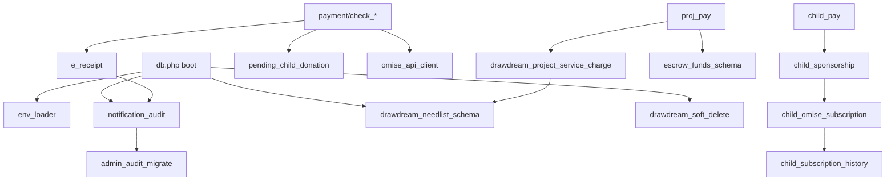

# คู่มืออ่านโค้ด — โฟลเดอร์ `includes/` ทุกไฟล์

เอกสารสำหรับอ่านทีละไฟล์ตามลำดับชื่อในโฟลเดอร์ (เรียง A–Z) รูปแบบเดียวกับ [`drawdream-features-code-walkthrough.md`](drawdream-features-code-walkthrough.md): มี **โค้ดจริง + เลขบรรทัด** แล้วตามด้วย **บทอธิบายต่อเนื่อง** ไม่แยกตารางรายบรรทัด

**อ่านแบบ Flow (ลำดับการทำงานจริง):** [`includes-flow-walkthrough.md`](includes-flow-walkthrough.md)

ฟีเจอร์เชิงธุรกิจ (เด็ก / โครงการ / สิ่งของ): ดู [`drawdream-features-code-walkthrough.md`](drawdream-features-code-walkthrough.md)

---

## สารบัญ (35 ไฟล์)

| # | ไฟล์ | หน้าที่สั้น |
|---|------|-------------|
| 1 | `address_helpers.php` | รวม/แยกที่อยู่ไทย |
| 2 | `admin_audit_migrate.php` | migration ตาราง `admin` |
| 3 | `child_omise_subscription.php` | Omise subscription เด็ก |
| 4 | `child_sponsorship.php` | กติกาอุปการะเด็ก |
| 5 | `child_subscription_history.php` | ประวัติแผนอุปการะ |
| 6 | `donate_category_resolve.php` | หมวดบริจาคใน `donate_category` |
| 7 | `donate_type.php` | รหัส `donate_type` + ป้ายไทย |
| 8 | `donation_stats_panel.php` | HTML แผงสถิติบริจาค |
| 9 | `drawdream_needlist_schema.php` | schema + JSON สิ่งของ |
| 10 | `drawdream_project_service_charge.php` | ค่าบริการ 5% โครงการ |
| 11 | `drawdream_project_status.php` | สถานะโครงการมาตรฐาน |
| 12 | `drawdream_project_updates_schema.php` | คอลัมน์ผลลัพธ์โครงการ |
| 13 | `drawdream_soft_delete.php` | `deleted_at` |
| 14 | `e_receipt.php` | ใบเสร็จอิเล็กทรอนิกส์ |
| 15 | `env_loader.php` | โหลด `.env` |
| 16 | `escrow_funds_schema.php` | เงินค้ำ escrow |
| 17 | `favicon_meta.php` | favicon กลาง |
| 18 | `foundation_account_verified.php` | มูลนิธิอนุมัติบัญชี |
| 19 | `foundation_analytics.php` | สถิติรายงานมูลนิธิ |
| 20 | `foundation_analytics_report_html.php` | HTML รายงาน |
| 21 | `foundation_banks.php` | รายชื่อธนาคาร |
| 22 | `foundation_review_schema.php` | รีวิวโปรไฟล์มูลนิธิ |
| 23 | `google_oauth.php` | Google Login |
| 24 | `needlist_donate_window.php` | หน้าต่างรับบริจาคสิ่งของ |
| 25 | `notification_audit.php` | แจ้งเตือน + คิวแอดมิน |
| 26 | `omise_api_client.php` | HTTP ไป Omise |
| 27 | `omise_user_messages.php` | ข้อความ error Omise ไทย |
| 28 | `payment_transaction_schema.php` | schema ตาราง `donation` |
| 29 | `pending_child_donation.php` | QR เด็ก pending→completed |
| 30 | `policy_consent_content.php` | HTML นโยบาย PDPA |
| 31 | `project_donation_dates.php` | วันเริ่มรับบริจาคโครงการ |
| 32 | `qr_payment_abandon.php` | ยกเลิก QR ค้าง |
| 33 | `site_footer.php` | footer HTML |
| 34 | `thai_address_fields.php` | partial ฟอร์มที่อยู่ |
| 35 | `utf8_helpers.php` | ตัด/นับข้อความไทย |

**Boot กลาง:** `db.php` โหลดหลายไฟล์นี้ทุก request (`env_loader`, `drawdream_project_status`, `admin_audit_migrate`, `drawdream_soft_delete`, `drawdream_needlist_schema`, `drawdream_project_updates_schema`, `notification_audit`)

---

# 1. address_helpers.php

**บทบาท:** แปลงที่อยู่ไทยระหว่างฟอร์ม (ช่องแยก) กับสตริงเดียวใน DB

```94:121:includes/address_helpers.php
function drawdream_merge_foundation_address_from_post(array $post): string
{
    $p = trim((string)($post['addr_province'] ?? ''));
    $a = trim((string)($post['addr_amphoe'] ?? ''));
    $tRaw = trim((string)($post['addr_tambon'] ?? ''));
    $z = trim((string)($post['addr_zip'] ?? ''));
    // ... แยก tambon ถ้ามี RS (0x1E) คั่น zip กับชื่อตำบล
    $geo = 'ต.' . $t . ' อ.' . $a . ' จ.' . $p . ' ' . $z;
    $line = drawdream_build_address_line_from_post($post);
    return $line !== '' ? $line . ' ' . $geo : $geo;
}
```

### อธิบาย

ไฟล์นี้ไม่แตะฐานข้อมูลโดยตรง — รับ **Input** จาก `$_POST` หรือสตริงที่เก็บแล้ว แล้วคืน **Output** เป็นข้อความมาตรฐาน `เลขที่ … ต.… อ.… จ.… รหัสไปรษณีย์` ฟังก์ชัน `drawdream_parse_saved_thai_address` ทำงานย้อนกลับเวลาแก้ไขโครงการ: แยกเลขที่/ซอย/ถนน และตำบล/อำเภอ/จังหวัดออกมาเติมฟอร์ม ใช้คู่กับ `thai_address_fields.php` ในหน้า `foundation_add_project.php`, `login.php`

---

# 2. admin_audit_migrate.php

**บทบาท:** สร้าง/ปรับตาราง `admin` สำหรับคิวงานแอดมิน (อนุมัติเด็ก/โครงการ/สิ่งของ)

```139:215:includes/admin_audit_migrate.php
function drawdream_ensure_admin_audit_table(mysqli $conn): void
{
    // CREATE TABLE admin ถ้ายังไม่มี
    // เพิ่มคอลัมน์ notif_type, action_type, target_entity, target_id, action_at, ...
    // FK ไป user (แอดมิน)
}
```

### อธิบาย

ทุกครั้งที่ระบบ boot หรือหน้าแอดมินโหลด จะเรียก `drawdream_ensure_admin_audit_table` เพื่อให้ schema ตาราง `admin` ตรงกับโค้ดปัจจุบัน (migration แบบ incremental ด้วย `SHOW COLUMNS` / `ALTER TABLE`) ฟังก์ชัน `drawdream_action_target_entity` แมป action เช่น `approve_child` → entity `child` เพื่อให้แอดมินกรองงานใน UI ได้ `drawdream_admin_deduplicate_entity_rows` รวมแถวซ้ำเมื่อมีการแจ้งเตือนซ้ำ target เดิม ไฟล์นี้ถูก **require** จาก `notification_audit.php` ก่อนส่งแจ้งเตือนหรือ `drawdream_log_admin_action`

---

# 3. child_omise_subscription.php

**บทบาท:** เชื่อม Omise กับอุปการะเด็ก — บันทึก charge, แผน, รอบหักถัดไป

```55:120:includes/child_omise_subscription.php
function drawdream_child_persist_subscription_paid_charge(
    mysqli $conn,
    string $chargeId,
    int $amountSatang,
    int $childId,
    int $donorUserId,
    string $source
): bool {
    // INSERT donation (child_subscription_charge, completed)
    // drawdream_child_subscription_history_log(...)
    // drawdream_child_sync_sponsorship_status(...)
}
```

```247:275:includes/child_omise_subscription.php
function drawdream_child_can_start_omise_subscription(mysqli $conn, int $childId, array $childRow, int $donorUserId): bool
{
    // โปรไฟล์เด็กอนุมัติ, ไม่มีแผน active ซ้ำ, ยังรับอุปการะได้
}
```

### อธิบาย

ไฟล์นี้เป็นจุดกลางหลัง Omise ตอบว่าชำระสำเร็จ: รับ **Input** `chargeId`, ยอดสตางค์, `child_id`, `donor_user_id` แล้ว **INSERT** แถว `donation` ประเภท `child_subscription_charge` และ log ลง `child_subscription_history` จากนั้นเรียก sync สถานะเด็กใน `child_sponsorship.php` ฟังก์ชันคำนวณเวลา `drawdream_subscription_next_charge_at` ใช้ timezone **Asia/Bangkok** และวันตัดบิล 1–28 เพื่อให้ cron หรือ schedule รู้ว่าหักรอบไหน `drawdream_child_can_start_omise_subscription` เป็น gate ก่อนหน้า `payment/child_subscription_create.php` อนุญาตสมัครหรือไม่ **Storage:** `donor.omise_customer_id`, `donor.omise_card_id`, `donation`, `child_subscription_history`

---

# 4. child_sponsorship.php

**บทบาท:** กฎธุรกิจอุปการะเด็กทั้งหมด — ยอดรอบ, สถานะ, ผลลัพธ์, ลบข้อมูลเด็ก (~974 บรรทัด)

```17:31:includes/child_sponsorship.php
function drawdream_child_plan_amount_by_code(string $planCode): ?float
{
    if ($plan === 'monthly')    return 700.0;
    if ($plan === 'semiannual') return 4200.0;
    if ($plan === 'yearly')     return 8400.0;
    return null;
}
```

```740:767:includes/child_sponsorship.php
function drawdream_child_sync_sponsorship_status(mysqli $conn, int $childId): void
{
    $hasActiveSub = drawdream_child_has_any_active_subscription($conn, $childId);
    $hasCoverage = drawdream_child_has_plan_coverage_now($conn, $childId);
    $status = ($hasActiveSub || $hasCoverage) ? 'อุปการะแล้ว' : 'รออุปการะ';
    UPDATE foundation_children SET status = ? WHERE child_id = ?
}
```

```401:415:includes/child_sponsorship.php
function drawdream_child_can_receive_donation(mysqli $conn, int $childId, array $childRow): bool
{
    if (approve_profile ไม่ใช่ อนุมัติ/กำลังดำเนินการ) return false;
    if (มี active subscription ใดๆ) return false;
    if (ครบยอดรอบเดือนแล้ว) return false;
    return true;
}
```

### อธิบาย

นี่คือ «สมอง» ฝั่งเด็ก อ่านจากตาราง **`donation`** (ยอด completed ในรอบปฏิทิน) และ **`child_subscription_history`** (แผน Omise) แล้วตอบคำถาม UI หลายแบบ: รับบริจาคได้ไหม, อุปการะครบไหม, ใครเป็นผู้อุปการะ, เปิดโพสต์ผลลัพธ์ได้ไหม ค่าคงที่ `DRAWDREAM_CHILD_DEFAULT_PLAN_AMOUNT = 700` คือเป้ารายเดือนเมื่อไม่มีแพ็กเกจอื่น ฟังก์ชัน coverage (`drawdream_child_plan_coverage_window`) คำนวณว่าหลังยกเลิกแผนแล้วยังมีสิทธิ์จนถึงวันไหน (ราย 6 เดือน/ปี) กลุ่ม outcome (`drawdream_child_outcome_*`) จัดการ JSON รูปใน `update_images` กลุ่มลบ (`drawdream_purge_child_related_data`) ลบ donation, history, ไฟล์รูปเมื่อแอดมินลบเด็จริง ถูกเรียกจาก `children_.php`, `payment/check_child_payment.php`, `foundation_child_outcome.php`, cron subscription

---

# 5. child_subscription_history.php

**บทบาท:** ตารางและฟังก์ชัน log ประวัติแผนอุปการะต่อคู่เด็ก–ผู้บริจาค

```71:130:includes/child_subscription_history.php
function drawdream_child_subscription_history_log(
    mysqli $conn,
    int $childId,
    ?int $donorUserId,
    ?int $donateId,
    ?string $recurringScheduleId,
    // ...
    string $eventType,
    ?string $previousStatus,
    string $currentStatus,
    string $recurringPlanCode,
    float $amountBaht,
    string $source,
    string $note,
    array $extra = []
): void
```

### อธิบาย

`drawdream_child_subscription_history_ensure_schema` สร้างตาราง **`child_subscription_history`** ถ้ายังไม่มี (คอลัมน์ `recurring_schedule_id`, `recurring_next_charge_at`, `current_status`, `event_type` ฯลฯ) ทุกเหตุการณ์สำคัญ — สมัคร, หักสำเร็จ, ยกเลิก — เรียก `drawdream_child_subscription_history_log` เพื่อ **INSERT** แถวประวัติ UI อ่านแถวล่าสุดเพื่อแสดงว่าแผน `active` หรือ `cancelled` และ cron อ่าน `recurring_next_charge_at` สำหรับ `local_cron_*`

---

# 6. donate_category_resolve.php

**บทบาท:** หา/สร้าง `category_id` ใน `donate_category` ให้ตรงกับเด็ก โครงการ สิ่งของ ค่าบริการ

```70:86:includes/donate_category_resolve.php
function drawdream_get_or_create_child_donate_category_id(mysqli $conn): int
{
    $id = drawdream_donate_category_id_for_child($conn);
    if ($id > 0) {
        return $id;
    }
    // INSERT donate_category (child_donate label) แล้วคืน insert_id
}
```

### อธิบาย

ทุกแถว **`donation`** ต้องมี `category_id` ชี้ไป `donate_category` เพื่อ join ชื่อหมวดในรายงานและใบเสร็จ ไฟล์นี้กันค่า id ไม่ตรงกันระหว่างเครื่อง — ถ้ายังไม่มีแถวหมวด «เด็ก» จะ **INSERT** ให้ มีฟังก์ชันคู่กันสำหรับ project, needitem, service_charge ถูกเรียกก่อน INSERT donation ในทุก `payment/check_*_payment.php`

---

# 7. donate_type.php

**บทบาท:** รหัสมาตรฐานใน `donation.donate_type` + ป้ายภาษาไทย

```6:51:includes/donate_type.php
const DRAWDREAM_DONATE_TYPE_CHILD_SUBSCRIPTION = 'child_subscription';
const DRAWDREAM_DONATE_TYPE_CHILD_SUBSCRIPTION_CHARGE = 'child_subscription_charge';
const DRAWDREAM_DONATE_TYPE_CHILD_ONE_TIME = 'child_one_time';
const DRAWDREAM_DONATE_TYPE_PROJECT = 'project';
const DRAWDREAM_DONATE_TYPE_NEED_ITEM = 'need_item';
const DRAWDREAM_DONATE_TYPE_NEED_SERVICE_CHARGE = 'need_service_charge';
const DRAWDREAM_DONATE_TYPE_PROJECT_SERVICE_CHARGE = 'project_service_charge';

function drawdream_donate_type_label_thai(?string $code): string
{
    return match ($k) {
        'child_subscription' => 'อุปการะเด็ก (รายรอบ)',
        // ...
    };
}
```

### อธิบาย

แยก **แถวแผน** (`child_subscription`) กับ **แต่ละรอบที่หัก** (`child_subscription_charge`) ชัดเจน ค่าบริการมูลนิธิ (`need_service_charge`, `project_service_charge`) ใช้ร่วมกับ `e_receipt.php` เพื่อไม่ออกใบเสร็จ `drawdream_donate_type_label_thai` ใช้ใน admin และรายงาน — ใน DB เก็บรหัสอังกฤษ logic อ่านรหัสเดียวกัน

---

# 8. donation_stats_panel.php

**บทบาท:** คำนวณตัวเลขและเรนเดอร์ HTML แผงสถิติบริจาค 4 ช่อง

```9:40:includes/donation_stats_panel.php
function drawdream_donation_stats_panel_values(mysqli $conn, int $categoryId, int $targetId): array
{
    // SELECT COUNT DISTINCT donor_id, SUM(amount), ยอดเดือนนี้, ทุนการศึกษา (ถ้าเป็นหมวดเด็ก)
    return ['donor_count' => ..., 'total' => ..., 'month_total' => ..., 'education_fund' => ...];
}
```

### อธิบาย

รับ **Input** `category_id` + `target_id` (เช่น child_id) **READ** จาก `donation` ที่ `payment_status = 'completed'` แล้วคืน array ให้ `drawdream_render_donation_stats_panel` echo HTML พร้อม aria-label เป็น helper พร้อมใช้ในหน้าโปรไฟล์เด็ก/โครงการ

---

# 9. drawdream_needlist_schema.php

**บทบาท:** schema ตาราง `foundation_needlist`, ค่าบริการ 5%, JSON รายการสิ่งของ (~811 บรรทัด)

```17:54:includes/drawdream_needlist_schema.php
function drawdream_needlist_service_charge_rate(): float
{
    return 0.05;
}

function drawdream_needlist_sync_service_charge_for_item(mysqli $conn, int $itemId): void
{
    // ยังไม่ครบเป้า → service_charge = 0
    // ครบแล้ว → ROUND(current_donate * 0.05, 2)
}
```

```667:700:includes/drawdream_needlist_schema.php
function foundation_needlist_encode_line_items_json(array $lineItems): array
{
    // คืน ['items' => need_items_json, 'pricing' => need_items_pricing_json]
}
```

### อธิบาย

ไฟล์ใหญ่ที่สุดฝั่งสิ่งของ `drawdream_ensure_needlist_schema` รัน migration คอลัมน์จำนวนมาก (`need_items_json`, `service_charge_paid_at`, `donate_window_end_at` ฯลฯ) ฟังก์ชัน encode/decode แยกรายการกับราคา — รายการใน `need_items_json` ไม่มีราคา ราคาอยู่ `need_items_pricing_json` เพื่อให้แอดมินปรับราคาหลังอนุมัติโดยไม่ทับชื่อสิ่งของ `foundation_needlist_line_items_from_row` รวมข้อมูลสำหรับแสดงหน้ารายการ โหลดจาก `db.php` ทุก request และใช้ทุกหน้า needlist / escrow / ชำระค่าบริการ

---

# 10. drawdream_project_service_charge.php

**บทบาท:** ค่าบริการ 5% เมื่อโครงการครบเป้า

```30:59:includes/drawdream_project_service_charge.php
function drawdream_project_sync_service_charge_for_project(mysqli $conn, int $projectId): void
{
    // UPDATE service_charge = 0 ถ้ายังไม่ครบ goal_amount
    // UPDATE service_charge = ROUND(current_donate * 0.05, 2) ถ้าครบแล้ว
}
```

### อธิบาย

 logic คล้าย needlist แต่ใช้ตาราง **`foundation_project`** และ `goal_amount` / `current_donate` เรียกหลัง `check_project_payment.php` สำเร็จ และก่อนมูลนิธิชำระผ่าน `payment/project_service_charge.php` **require** `drawdream_needlist_schema.php` เพื่อใช้อัตรา 5% ร่วมกัน

---

# 11. drawdream_project_status.php

**บทบาท:** ทำให้สถานะโครงการใน DB เป็นชุดมาตรฐาน (pending / approved / …)

```14:42:includes/drawdream_project_status.php
function drawdream_normalize_foundation_project_statuses(mysqli $conn): void
{
    // UPDATE แปลงสถานะเก่า (ภาษาไทย/ชื่ออื่น) → pending, approved, rejected, completed, purchasing, done
}
```

### อธิบาย

เรียกจาก `db.php` ตอน boot เพื่อแก้ข้อมูลเก่า `drawdream_sql_project_is_pending` คืนสตริง SQL snippet ให้ query หน้า admin กรองโครงการรออนุมัติได้สม่ำเสมอ

---

# 12. drawdream_project_updates_schema.php

**บทบาท:** คอลัมน์โพสต์ผลลัพธ์โครงการ

```10:34:includes/drawdream_project_updates_schema.php
function drawdream_ensure_foundation_project_update_columns(mysqli $conn): void
{
    // ALTER foundation_project: update_text, update_at, update_images
}
```

### อธิบาย

รองรับ `foundation_post_update.php` — มูลนิธิอัปโหลดข้อความและรูปหลักฐานหลังสถานะ `purchasing` / `done` เรียกจาก `db.php` และ `project_result.php`

---

# 13. drawdream_soft_delete.php

**บทบาท:** soft delete เด็กและโครงการ

```13:27:includes/drawdream_soft_delete.php
function drawdream_ensure_soft_delete_columns(mysqli $conn): void
{
    // ALTER foundation_children / foundation_project: deleted_at, project_delete_reason
}
```

### อธิบาย

แทนการ DELETE ถาวร ระบบตั้ง `deleted_at = NOW()` หน้าสาธารณะ query ด้วย `deleted_at IS NULL` เสมอ เรียกทุก request ผ่าน `db.php`

---

# 14. e_receipt.php

**บทบาท:** แจ้งเตือนใบเสร็จหลังบริจาคสำเร็จ (ไม่สร้าง PDF บนเซิร์ฟเวอร์)

```46:77:includes/e_receipt.php
function drawdream_donation_eligible_for_e_receipt(mysqli $conn, int $donateId): bool
{
    // completed + ไม่ใช่ค่าบริการมูลนิธิ + donor ไม่ใช่ role foundation
}
```

```115:149:includes/e_receipt.php
function drawdream_send_e_receipt_notification_by_donate_id(mysqli $conn, int $donateId): bool
{
    return drawdream_send_notification(
        $conn, $donorId, 'e_receipt_issued',
        'ได้รับใบเสร็จอิเล็กทรอนิกส์', ...,
        'donation_receipt.php?donate_id=' . $donateId,
        'e_receipt:' . $donateId
    );
}
```

### อธิบาย

หลัง `donation` เป็น **completed** ไฟล์ payment ต่างๆ เรียกฟังก์ชันนี้เพื่อ **INSERT** `notifications` ให้ผู้บริจาคเปิด `donation_receipt.php` มูลนิธิและรายการค่าบริการ 5% ถูก exclude รายละเอียดเต็มอยู่ใน [`drawdream-features-code-walkthrough.md` ข้อ 4](drawdream-features-code-walkthrough.md#ข้อ-4-ใบเสร็จอัตโนมัติ--แจ้งเตือน--หน้าใบเสร็จ-ไม่สร้าง-pdf-ในเซิร์ฟเวอร์)

---

# 15. env_loader.php

**บทบาท:** โหลด `.env` สำหรับ dev (Omise keys, Google OAuth)

```12:56:includes/env_loader.php
function drawdream_load_env_file(?string $envPath = null): void
{
    static $loaded = false;
    if ($loaded) { return; }
    // อ่าน ../.env → putenv / $_ENV (ไม่ทับค่าที่มีอยู่แล้ว)
}
```

### อธิบาย

เรียกครั้งเดียวต่อ request จาก `db.php` และ `google_oauth.php` ช่วยให้เครื่อง local ไม่ต้อง hardcode secret ใน `payment/config.php` บน production มักใช้ environment ของโฮสต์แทน

---

# 16. escrow_funds_schema.php

**บทบาท:** บันทึกเงินบริจาคที่ «พัก» รอแอดมินโอนให้มูลนิธิ

```120:147:includes/escrow_funds_schema.php
function drawdream_escrow_funds_try_insert_holding_for_target(
    mysqli $conn,
    string $targetType,
    int $targetId,
    int $donateId,
    string $chargeId,
    float $amountBaht
): bool
```

```179:182:includes/escrow_funds_schema.php
function drawdream_escrow_funds_release_holding_for_project(mysqli $conn, int $project_id): int
```

### อธิบาย

เมื่อบริจาคโครงการ/สิ่งของสำเร็จ ระบบ **INSERT** แถวใน **`escrow_funds`** สถานะ holding แดชบอร์ดแอดมินรวมยอดค้ำได้ ตอน `admin_escrow.php` ยืนยันโอน (`confirm_transfer`) จะ **release** holding ของโครงการนั้น คู่กับ UPDATE `project_status = purchasing`

---

# 17. favicon_meta.php

**บทบาท:** echo `<link rel="icon">` ชุดเดียวทั้งเว็บ

### อธิบาย

ไม่มีฟังก์ชัน PHP — include ใน `<head>` ของหน้าหลักและ `payment/*` ใช้ `$GLOBALS['_drawdream_favicon_done']` กัน include ซ้ำ คำนวณ path ไป `img/logobig.png` จากตำแหน่งสคริปต์

---

# 18. foundation_account_verified.php

**บทบาท:** มูลนิธิต้องผ่านการอนุมัติบัญชีก่อนใช้ฟีเจอร์หลัก

```30:50:includes/foundation_account_verified.php
function drawdream_foundation_account_is_verified(mysqli $conn): bool
{
    if (($_SESSION['role'] ?? '') !== 'foundation') {
        return true;
    }
    return (int)($_SESSION['account_verified'] ?? 0) === 1;
}

function drawdream_foundation_require_account_verified(mysqli $conn): void
{
    if (!drawdream_foundation_account_is_verified($conn)) {
        header('Location: foundation.php?verify_required=1');
        exit;
    }
}
```

### อธิบาย

**READ** `foundation_profile.account_verified` ซิงก์เข้า **session** ทุกหน้ามูลนิธิที่สำคัญเรียก `drawdream_foundation_require_account_verified` ก่อนเพิ่มเด็ก/โครงการ/สิ่งของ

---

# 19. foundation_analytics.php

**บทบาท:** รวมตัวเลขรายงานมูลนิธิ (ยอดบริจาค, หมวดยอดนิยม, retention อุปการะ)

```45:80:includes/foundation_analytics.php
function drawdream_foundation_analytics_totals(mysqli $conn, int $foundationId, string $foundationName): array
{
    // รวมยอดจาก donation join กับ children / project / needlist ของมูลนิธิ
}
```

### อธิบาย

ใช้ `donate_category_resolve.php` หา category id แล้ว aggregate จาก **`donation`** ฟังก์ชัน sponsorship อ่าน **`child_subscription_history`** คำนวณ active/cancel สำหรับรายงาน PDF/HTML แอดมิน

---

# 20. foundation_analytics_report_html.php

**บทบาท:** สร้าง HTML fragment รายงานจากข้อมูล analytics

```16:131:includes/foundation_analytics_report_html.php
function drawdream_foundation_analytics_report_html_fragment(mysqli $conn, int $foundationId): ?string
```

### อธิบาย

**require** `foundation_analytics.php` แล้วเรียกฟังก์ชัน totals/popular/sponsorship มาจัด layout ตารางและ KPI สำหรับพิมพ์ PDF หรือแสดงบนเว็บ

---

# 21. foundation_banks.php

**บทบาท:** รายชื่อธนาคารใน `<select>` ฟอร์มมูลนิธิ

```10:28:includes/foundation_banks.php
function drawdream_foundation_bank_list(): array
{
    return [
        'กสิกรไทย' => 'กสิกรไทย (KBank)',
        // ...
    ];
}
```

### อธิบาย

**Output** เป็น array value=>label ไม่แตะ DB — ค่า value คือสตริงที่เก็บใน `foundation_profile` / บัญชีเด็ก ใช้ใน `login.php` (สมัครมูลนิธิ), `foundation_donate_info.php`

---

# 22. foundation_review_schema.php

**บทบาท:** คอลัมน์หมายเหตุเมื่อแอดมินรีวิวมูลนิธิ

```7:19:includes/foundation_review_schema.php
function drawdream_foundation_review_ensure_schema(mysqli $conn): void
{
    // ALTER foundation_profile: review_note, reviewed_at
}
```

### อธิบาย

เรียกจาก `admin_approve_foundation.php` เมื่ออนุมัติ/ปฏิเสธบัญชีมูลนิธิ

---

# 23. google_oauth.php

**บทบาท:** OAuth 2.0 กับ Google (login ด้วย Google)

```59:78:includes/google_oauth.php
function drawdream_google_oauth_build_auth_url(string $state): string
{
    // redirect ไป accounts.google.com/o/oauth2/v2/auth
}
```

### อธิบาย

**Input** client_id/secret จาก `.env` หรือ `config/google_oauth.local.php` หลัง callback แลก code เป็น token แล้วดึง userinfo ไปสร้าง/ล็อกอิน **`user`** ใช้ใน `auth/google_start.php`, `auth/google_callback.php` ไม่เกี่ยว Omise

---

# 24. needlist_donate_window.php

**บทบาท:** กำหนดวันสิ้นสุดรับบริจาครายการสิ่งของ (+1 เดือนจากอนุมัติ)

```23:35:includes/needlist_donate_window.php
function drawdream_needlist_compute_donate_window_end(string $periodLabel, DateTimeImmutable $approvalMoment): ?string
{
    return $approvalMoment->modify('+1 month')->format('Y-m-d H:i:s');
}
```

```37:50:includes/needlist_donate_window.php
function drawdream_needlist_sql_open_for_donation(string $alias = ''): string
{
    // SQL: approve_item = 'approved' AND (donate_window_end_at IS NULL OR donate_window_end_at > NOW())
}
```

### อธิบาย

หลังแอดมินอนุมัติรายการ ระบบตั้ง **`donate_window_end_at`** ผู้บริจาคบริจาคได้เฉพาะในช่วงนี้ ฟังก์ชัน SQL snippet ใช้ในหน้ารายการสาธารณะและ `payment/foundation_donate.php` ถูก require จาก `drawdream_needlist_schema.php` ตอน migrate

---

# 25. notification_audit.php

**บทบาท:** ระบบแจ้งเตือนผู้ใช้ + คิวงานแอดมิน + audit log (~793 บรรทัด)

```379:400:includes/notification_audit.php
function drawdream_send_notification(
    mysqli $conn,
    int $userId,
    string $notifType,
    string $title,
    string $message,
    string $link = '',
    string $entityKey = ''
): bool
```

```618:650:includes/notification_audit.php
function drawdream_log_admin_action(
    mysqli $conn,
    int $adminUserId,
    string $actionType,
    string $targetEntity,
    int $targetId,
    string $remark = ''
): void
```

### อธิบาย

หัวใจการสื่อสารในแอป `drawdream_ensure_notifications_table` สร้าง **`notifications`** `drawdream_send_notification` **INSERT** แถวให้ user ที่ระบุ (เด็กส่งโปรไฟล์ → แจ้งแอดมิน, บริจาคสำเร็จ → แจ้งมูลนิธิ, ใบเสร็จ → แจ้ง donor) กลุ่ม `drawdream_notify_admins_*` และ `drawdream_record_foundation_submitted_*` สร้างงานในตาราง **`admin`** ผ่าน `drawdream_log_admin_action` โหลดจาก `db.php` ทุก request

---

# 26. omise_api_client.php

**บทบาท:** HTTP client ไป Omise API

```59:108:includes/omise_api_client.php
function drawdream_omise_post_form(string $path, array $fields): array
{
    // curl POST form-urlencoded ไป OMISE_API_URL + path
    // Authorization: Bearer OMISE_SECRET_KEY
}
```

```134:154:includes/omise_api_client.php
function drawdream_omise_create_card_charge(
    string $customerId,
    string $cardId,
    int $amountSatang,
    string $description,
    array $metadata = []
): array
```

### อธิบาย

ทุกการเรียก Omise ควรผ่านไฟล์นี้เพื่อตั้ง CA bundle (Windows dev), retry, และ decode JSON **Output** เป็น array response ของ Omise (`id`, `paid`, `status`, `object` = error ฯลฯ) ใช้ใน subscription create, cron charges, บาง flow QR

---

# 27. omise_user_messages.php

**บทบาท:** แปล error Omise เป็นข้อความไทยให้ผู้ใช้

```34:84:includes/omise_user_messages.php
function drawdream_omise_error_message_for_user(?array $res, string $fallbackThai): string
{
    // แมป SSL, not found, schedule blocked, invalid card ฯลฯ
}
```

### อธิบาย

`payment/child_subscription_create.php` แสดงข้อความจากฟังก์ชันนี้แทน raw JSON Omise ช่วยอธิบายกรณีบัญชี test ยังเปิด Schedule ไม่ได้

---

# 28. payment_transaction_schema.php

**บทบาท:** migration คอลัมน์ธุรกรรมในตาราง `donation`

```88:112:includes/payment_transaction_schema.php
function drawdream_payment_transaction_ensure_schema(mysqli $conn): void
{
    // omise_charge_id, donate_type, index
    drawdream_donation_migrate_recurring_type_to_donate_type($conn);
    drawdream_donation_backfill_donate_type($conn);
}
```

### อธิบาย

ก่อน INSERT donation ทุก flow ควรแน่ใจว่ามีคอลัมน์ `omise_charge_id` (กันซ้ำ charge) และ `donate_type` (แทน `recurring_type` เก่า) **require** `donate_type.php`

---

# 29. pending_child_donation.php

**บทบาท:** บริจาคเด็กแบบ QR — สร้างแถว pending แล้ว finalize เมื่อชำระสำเร็จ

```20:60:includes/pending_child_donation.php
function drawdream_insert_pending_child_donation(...): int
{
    // INSERT donation payment_status = 'pending', omise_charge_id = ...
}
```

```63:135:includes/pending_child_donation.php
function drawdream_finalize_child_donation(...): bool
{
    // UPDATE completed + drawdream_child_sync_sponsorship_status
}
```

### อธิบาย

ใช้ใน `payment/check_child_payment.php` — ตอนสร้าง QR ได้ `donate_id` ก่อน ตอน Omise สำเร็จค่อย finalize ใน transaction

---

# 30. policy_consent_content.php

**บทบาท:** HTML เนื้อหานโยบายความเป็นส่วนตัว (include ซ้ำ)

### อธิบาย

ไม่มีฟังก์ชัน — เป็น fragment HTML ใช้ใน `policy_consent.php` และโมดัลยินยอมใน `foundation_add_children.php` (PDPA)

---

# 31. project_donation_dates.php

**บทบาท:** วันเริ่มรับบริจาคโครงการจากแถวโครงการ

```12:25:includes/project_donation_dates.php
function drawdream_project_effective_donation_start(array $p): ?string
{
    // คืน start_date รูปแบบ Y-m-d หรือ null
}
```

### อธิบาย

ใช้ใน `project.php` และ `payment/payment_project.php` แสดง/เช็กว่าโครงการเปิดรับบริจาคแล้วหรือยัง

---

# 32. qr_payment_abandon.php

**บทบาท:** ยกเลิก QR — Omise expire + ล้าง session + ลบ donation pending

```13:38:includes/qr_payment_abandon.php
function drawdream_clear_pending_payment_session(): void
{
    unset($_SESSION['pending_charge_id'], $_SESSION['pending_amount'], ...);
}
```

```79:113:includes/qr_payment_abandon.php
function drawdream_abandon_pending_donation_by_charge(...)
{
    drawdream_qr_abandon_expire_omise_charge($chargeId);
    // DELETE FROM donation WHERE payment_status = 'pending' ...
}
```

### อธิบาย

**ยกเลิก QR ≠ void/refund** — ก่อน DELETE เรียก `drawdream_omise_expire_pending_charge()` ใน `payment/omise_helpers.php` (`POST /charges/{id}/expire`) เพื่อปิด QR ที่ Omise ยัง pending

เมื่อเริ่มบริจาคใหม่ `drawdream_abandon_all_pending_qr_for_donor()` expire ทุก charge ของ donor แล้วลบ pending ทั้งหมด มีฟังก์ชันแยก session ค่าบริการ needlist/project

---

# 33. site_footer.php

**บทบาท:** footer HTML กลาง (โลโก้, ลิงก์)

### อธิบาย

ตั้ง `$footer_base_path` ก่อน include ถ้าอยู่ใน subdirectory — include จาก `foundation.php` และหน้าที่ต้องการ footer เดียวกับ homepage

---

# 34. thai_address_fields.php

**บทบาท:** partial HTML ฟิลด์จังหวัด→ตำบล (dropdown เชื่อม `js/thai_address_select.js`)

### อธิบาย

รับตัวแปร `$thai_address_options` (ค่าเดิมตอนแก้ไข) แล้ว echo `<select>` และ input ซอย/ถนน บันทึกผ่าน `drawdream_merge_foundation_address_from_post` ใน `address_helpers.php`

---

# 35. utf8_helpers.php

**บทบาท:** นับ/ตัดสตริง UTF-8 อย่างปลอดภัย

```7:54:includes/utf8_helpers.php
function drawdream_utf8_strlen(string $s): int
function drawdream_utf8_substr(string $s, int $start, ?int $length = null): string
```

### อธิบาย

ใช้ `mbstring` ถ้ามี ไม่งั้น fallback iconv/pcre — กันตัดกลางอักขระไทยเวลาจำกัดความยาวข้อความใน `foundation_child_outcome.php`, `login.php` (ชื่อมูลนิธิ)

---

## แผนภาพการพึ่งพา (ย่อ)



---

*อัปเดตตาม `includes/` ใน repo DrawDream — 35 ไฟล์ เรียงตามชื่อไฟล์*
