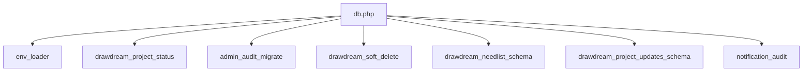

# คู่มือ Flow — โฟลเดอร์ `includes/` (35 ไฟล์)

เรียงตาม **ลำดับที่ถูกเรียกใช้จริง** ในระบบ แยกตาม Flow ธุรกิจ — ไม่เรียง A–Z

รายละเอียดโค้ดทีละไฟล์ (เลขบรรทัด): [`includes-code-walkthrough.md`](includes-code-walkthrough.md)  
Flow หน้า PHP + payment ครบวงจร: [`drawdream-flow-walkthrough.md`](drawdream-flow-walkthrough.md)

---

## สารบัญตาม Flow

| ส่วน | ไฟล์ใน includes ที่เกี่ยว |
|------|---------------------------|
| [Boot ทุก request](#boot-ทุก-request) | 7 ไฟล์จาก `db.php` |
| [Flow 1 เด็ก](#flow-1--เด็ก) | 8 ไฟล์ |
| [Flow 2 โครงการ](#flow-2--โครงการ) | 6 ไฟล์ |
| [Flow 3 สิ่งของ](#flow-3--สิ่งของ) | 3 ไฟล์ |
| [Flow 4 ชำระเงิน / ใบเสร็จ](#flow-4--ชำระเงิน--ใบเสร็จ) | 9 ไฟล์ |
| [ร่วม UI / มูลนิธิ](#ร่วม-ui--มูลนิธิ-ไม่ผูก-flow-เดียว) | ที่เหลือ |

---

## Boot ทุก request

โหลดจาก [`db.php`](../db.php) ก่อนหน้าอื่นทำงาน:

| ลำดับ | ไฟล์ | หน้าที่สั้น |
|-------|------|-------------|
| 1 | `env_loader.php` | โหลด `.env` → `getenv` |
| 2 | `drawdream_project_status.php` | ค่าสถานะโครงการมาตรฐาน |
| 3 | `admin_audit_migrate.php` | สร้าง/อัปเดตตาราง `admin` |
| 4 | `drawdream_soft_delete.php` | helper `deleted_at` |
| 5 | `drawdream_needlist_schema.php` | คอลัมน์ + JSON สิ่งของ |
| 6 | `drawdream_project_updates_schema.php` | คอลัมน์ผลลัพธ์โครงการ |
| 7 | `notification_audit.php` | แจ้งเตือน + `drawdream_log_admin_action` |

---

## Flow 1 — เด็ก

ลำดับเมื่อผู้ใช้ทำครบวงจรอุปการะ:

| ลำดับ | ไฟล์ | ถูกเรียกเมื่อ | หน้าที่สั้น |
|-------|------|----------------|-------------|
| 1 | `child_sponsorship.php` | เปิด `children_donate.php`, หลังชำระ | แผนราคา, `can_receive_donation`, sync `status` |
| 2 | `donate_type.php` | บันทึก `donation` | รหัส `child_donation`, `child_subscription_*` |
| 3 | `donate_category_resolve.php` | บันทึก `donation` | หมวดใน `donate_category` |
| 4 | `payment_transaction_schema.php` | ก่อน INSERT `donation` | คอลัมน์ธุรกรรมมาตรฐาน |
| 5 | `pending_child_donation.php` | `check_child_payment` | QR pending → completed |
| 6 | `qr_payment_abandon.php` | `abandon_qr.php` | Omise expire + ลบ pending ตาม charge_id |
| 7 | `omise_api_client.php` | subscription / webhook | HTTP Omise |
| 8 | `child_omise_subscription.php` | สมัคร/หักรอบสำเร็จ | persist charge + sync เด็ก |
| 9 | `child_subscription_history.php` | หลังสมัคร/ยกเลิก | log ตาราง `child_subscription_history` |
| 10 | `e_receipt.php` | หลัง `donation` completed | เลขที่ใบเสร็จอัตโนมัติ |

**หมายเหตุ:** `child_sponsorship.php` ถูก require จากหลายหน้า — เป็นศูนย์กลางกติกาเด็ก

---

## Flow 2 — โครงการ

| ลำดับ | ไฟล์ | ถูกเรียกเมื่อ | หน้าที่สั้น |
|-------|------|----------------|-------------|
| 1 | `address_helpers.php` | submit `foundation_add_project` | รวมที่อยู่ → `location` |
| 2 | `thai_address_fields.php` | แสดงฟอร์มโครงการ/login | partial dropdown ที่อยู่ |
| 3 | `drawdream_project_status.php` | อนุมัติ / escrow | ตรวจ/ตั้ง `project_status` |
| 4 | `project_donation_dates.php` | เปิดรับบริจาค | วันเริ่ม–สิ้นสุด |
| 5 | `drawdream_project_service_charge.php` | ครบเป้า / หลังบริจาค | คำนวณ `service_charge` 5% |
| 6 | `escrow_funds_schema.php` | ครบเป้า, แอดมินโอน | เงินค้ำ + ปล่อย holding |
| 7 | `drawdream_project_updates_schema.php` | โพสต์ผล | คอลัมน์ `update_*` |
| 8 | `e_receipt.php` | `check_project_payment` | ใบเสร็จบริจาคโครงการ |

---

## Flow 3 — สิ่งของ

| ลำดับ | ไฟล์ | ถูกเรียกเมื่อ | หน้าที่สั้น |
|-------|------|----------------|-------------|
| 1 | `drawdream_needlist_schema.php` | ทุกหน้า needlist | schema, encode JSON, sync ค่าบริการ 5% |
| 2 | `needlist_donate_window.php` | แอดมินอนุมัติ | `donate_window_end_at` |
| 3 | `e_receipt.php` | `check_needlist_payment` | ใบเสร็จบริจาคสิ่งของ |

`drawdream_needlist_schema.php` ถูก boot จาก `db.php` — ฟังก์ชัน sync ค่าบริการทำงานเหมือน `drawdream_project_service_charge.php` แต่ใช้ `foundation_needlist`

---

## Flow 4 — ชำระเงิน / ใบเสร็จ

ใช้ร่วมทั้ง 3 flow + homepage:

| ลำดับ | ไฟล์ | หน้าที่สั้น |
|-------|------|-------------|
| 1 | `omise_api_client.php` | cURL Omise (charge, schedule, revoke) |
| 2 | `omise_user_messages.php` | แปล error Omise เป็นภาษาไทย |
| 3 | `payment_transaction_schema.php` | มาตรฐานแถว `donation` |
| 4 | `donate_type.php` | ป้ายประเภทธุรกรรม |
| 5 | `donate_category_resolve.php` | หมวดบริจาค |
| 6 | `qr_payment_abandon.php` | ยกเลิก QR: expire Omise + ลบ pending (ทุกประเภท) |
| 7 | `pending_child_donation.php` | เฉพาะเด็ก PromptPay |
| 8 | `e_receipt.php` | ออกใบเสร็จหลัง `completed` |

ดูหน้า `payment/*` ตามลำดับใน [`payment-code-walkthrough.md`](payment-code-walkthrough.md)

---

## ร่วม UI / มูลนิธิ (ไม่ผูก flow เดียว)

| ไฟล์ | หน้าที่สั้น | ใช้กับ |
|------|-------------|--------|
| `foundation_account_verified.php` | บล็อกมูลนิธิที่ยังไม่ผ่านอนุมัติบัญชี | ทุกหน้า `foundation_*` |
| `foundation_banks.php` | รายชื่อธนาคารในฟอร์ม | เด็ก, โปรไฟล์ |
| `foundation_review_schema.php` | คอลัมน์รีวิวมูลนิธิ | `admin_approve_foundation` |
| `foundation_analytics.php` | คำนวณ KPI รายงาน | analytics มูลนิธิ/แอดมิน |
| `foundation_analytics_report_html.php` | HTML รายงาน → PDF | `*_analytics_report_pdf.php` |
| `donation_stats_panel.php` | HTML แผงสถิติบริจาค | homepage / dashboard |
| `policy_consent_content.php` | HTML นโยบาย | ฟอร์มลงทะเบียน |
| `favicon_meta.php` | `<link rel="icon">` กลาง | layout หลายหน้า |
| `site_footer.php` | footer HTML | หน้าสาธารณะ |
| `google_oauth.php` | Google Login | `auth/google_*` |
| `utf8_helpers.php` | ตัด/นับข้อความไทย | ฟอร์มยาว |

---

## ตารางรวม 35 ไฟล์ (อ้างอิงเร็ว)

| # | ไฟล์ | Flow หลัก |
|---|------|-----------|
| 1 | `address_helpers.php` | 2 โครงการ |
| 2 | `admin_audit_migrate.php` | Boot |
| 3 | `child_omise_subscription.php` | 1 เด็ก |
| 4 | `child_sponsorship.php` | 1 เด็ก |
| 5 | `child_subscription_history.php` | 1 เด็ก |
| 6 | `donate_category_resolve.php` | 4 ชำระเงิน |
| 7 | `donate_type.php` | 4 ชำระเงิน |
| 8 | `donation_stats_panel.php` | ร่วม UI |
| 9 | `drawdream_needlist_schema.php` | Boot + 3 สิ่งของ |
| 10 | `drawdream_project_service_charge.php` | 2 โครงการ |
| 11 | `drawdream_project_status.php` | Boot + 2 |
| 12 | `drawdream_project_updates_schema.php` | Boot + 2 |
| 13 | `drawdream_soft_delete.php` | Boot + ทุก flow |
| 14 | `e_receipt.php` | 4 ใบเสร็จ |
| 15 | `env_loader.php` | Boot |
| 16 | `escrow_funds_schema.php` | 2 โครงการ |
| 17 | `favicon_meta.php` | ร่วม UI |
| 18 | `foundation_account_verified.php` | ร่วมมูลนิธิ |
| 19 | `foundation_analytics.php` | ร่วงมูลนิธิ |
| 20 | `foundation_analytics_report_html.php` | ร่วมมูลนิธิ |
| 21 | `foundation_banks.php` | ร่วมมูลนิธิ |
| 22 | `foundation_review_schema.php` | ร่วมมูลนิธิ |
| 23 | `google_oauth.php` | ร่วม auth |
| 24 | `needlist_donate_window.php` | 3 สิ่งของ |
| 25 | `notification_audit.php` | Boot + อนุมัติทุก flow |
| 26 | `omise_api_client.php` | 1 + 4 |
| 27 | `omise_user_messages.php` | 4 |
| 28 | `payment_transaction_schema.php` | 4 |
| 29 | `pending_child_donation.php` | 1 + 4 |
| 30 | `policy_consent_content.php` | ร่วมฟอร์ม |
| 31 | `project_donation_dates.php` | 2 โครงการ |
| 32 | `qr_payment_abandon.php` | 4 |
| 33 | `site_footer.php` | ร่วม UI |
| 34 | `thai_address_fields.php` | 2 + โปรไฟล์ |
| 35 | `utf8_helpers.php` | ร่วมฟอร์ม |
