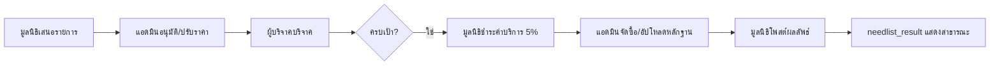

# คู่มืออ่านโค้ด — ระบบรายการสิ่งของ (Needlist) ทั้ง 8 ฟีเจอร์

เอกสารนี้สำหรับเตรียมอธิบายอาจารย์: อ่านแบบ **ทีละบรรทัด** — ทุกบล็อกโค้ดด้านล่างเป็นโค้ดจริงจากไฟล์ (ไม่ย่อ logic สำคัญ)

### สัญลักษณ์การทำงานกับฐานข้อมูล (DBeaver)

| คำในเอกสาร | ความหมายในโค้ด PHP |
|------------|-------------------|
| **READ (SELECT)** | `$conn->prepare("SELECT ...")` → อ่านแถวจากตาราง ไม่แก้ข้อมูล |
| **INSERT** | `INSERT INTO ...` → สร้างแถวใหม่ |
| **UPDATE (EDIT)** | `UPDATE ... SET ... WHERE` → แก้แถวเดิม |
| **DELETE** | ระบบ needlist แทบไม่ลบแถว — ใช้ `approve_item = 'rejected'` แทน |

| คำในเอกสาร | ความหมาย |
|------------|----------|
| **Input** | ค่าที่เข้ามา (จากฟอร์ม POST, GET, session, หรือแถว DB) |
| **Output** | ค่าที่ฟังก์ชัน/บรรทัดนั้นส่งออก (ตัวแปร, return, HTML, JSON) |
| **Storage** | คอลัมน์ตารางที่เก็บถาวร — เปิดดูใน DBeaver ได้ |

ตารางหลัก: **`foundation_needlist`**

| คอลัมน์ | ใช้กับฟีเจอร์ |
|--------|----------------|
| `need_items_json` | รายการ (หมวด, ชื่อ, จำนวน) — ไม่เก็บราคา |
| `need_items_pricing_json` | ราคา/ชิ้น, ราคารวม ต่อบรรทัด (ราคาปัจจุบัน) |
| `submitted_need_items_pricing_json` | snapshot ราคาตอนมูลนิธิเสนอ |
| `total_price` | ยอดเป้าหมายปัจจุบัน |
| `submitted_total_price` | ยอดที่มูลนิธิเสนอครั้งแรก |
| `current_donate` | ยอดบริจาคที่ได้รับแล้ว |
| `service_charge`, `service_charge_paid_at` | ค่าบริการ 5% และเวลาชำระ |
| `price_reviewed_at` | เวลาแอดมินปรับราคา |
| `donate_window_end_at` | ปิดรับบริจาคอัตโนมัติ |
| `approve_item` | `pending` → `approved` → `purchasing` → `done` / `rejected` |
| `admin_delivery_*` | หลักฐานจัดส่งจากแอดมิน |
| `update_text`, `update_images`, `update_at` | ผลลัพธ์ที่มูลนิธิโพสต์ให้ผู้บริจาค |

Helper กลาง: [`includes/drawdream_needlist_schema.php`](../includes/drawdream_needlist_schema.php)

**Flow สิ่งของแบบตารางไฟล์ (จนจบ):** [`drawdream-flow-walkthrough.md`](drawdream-flow-walkthrough.md#flow-3--สิ่งของ-needlist)

---

## ภาพรวม Flow



---

## ข้อ 1 — กรอกราคา / จำนวน / คำนวณยอดเป้าหมาย

**ไฟล์หลัก:** [`foundation_add_need.php`](../foundation_add_need.php)

### 1.1 เปิดหน้า — ตรวจสิทธิ์

```10:38:foundation_add_need.php
session_start();
include 'db.php';
require_once __DIR__ . '/includes/drawdream_needlist_schema.php';
// ...
if (($_SESSION['role'] ?? '') !== 'foundation') {
    header("Location: homepage.php");
    exit();
}
// ...
$foundation_id = (int)$fp['foundation_id'];
```

- ต้องล็อกอินเป็น role `foundation` และมีโปรไฟล์มูลนิธิ

### 1.2 โหมดแก้ไข — โหลด JSON จาก DB ใส่ฟอร์ม

```201:271:foundation_add_need.php
if ($editRow && ($_SERVER['REQUEST_METHOD'] ?? '') !== 'POST') {
    // ...
    $_POST['item_price_' . $slotIdx] = $rowPrice > 0 ? (string)round($rowPrice, 2) : '';
    $_POST['item_qty_' . $slotIdx] = $rowQty > 0 ? (string)(int)$rowQty : '';
    // ...
    $_POST['goal_amount'] = (string)(int)round($goalFromTotal);
}
```

- อ่าน `need_items_json` + `need_items_pricing_json` แล้วเติม `item_category_N`, `item_price_N`, `item_qty_N`
- แก้ได้เฉพาะ `approve_item` เป็น `pending` หรือ `rejected` (บรรทัด 53–56)

### 1.3 ฟอร์ม HTML — ชื่อ field ที่ส่ง POST

```791:837:foundation_add_need.php
<?php for ($slot = 1; $slot <= 5; $slot++): ?>
    <select name="item_category_<?= $slot ?>" class="need-slot-category" ...>
    <select name="item_option_<?= $slot ?>" class="need-slot-item" ...>
    <input name="item_price_<?= $slot ?>" class="need-slot-price" placeholder="ราคา/ชิ้น">
    <input name="item_qty_<?= $slot ?>" class="need-slot-qty" placeholder="จำนวน">
    <input name="item_custom_<?= $slot ?>" ...>
<?php endfor; ?>
<input type="hidden" name="goal_amount" id="goalAmount" ...>
```

### 1.4 JavaScript — คำนวณยอดบนหน้าจอ

```1048:1062:foundation_add_need.php
function updateTotal() {
    let g = 0;
    slotPriceEls.forEach((pEl, idx) => {
        const price = parseFloat((pEl && pEl.value) || '0');
        const qty = parseFloat((slotQtyEls[idx] && slotQtyEls[idx].value) || '0');
        if (price > 0 && qty > 0) {
            g += (price * qty);
        }
    });
    goalAmount.value = String(g.toFixed(2));
    totalBox.textContent = "เป้าหมาย: " + g.toLocaleString('th-TH', ...) + " บาท";
}
```

- พิมพ์ราคา/จำนวน → เรียก `updateTotal()` ทันที (event `input` บรรทัด 1146+)

### 1.5 กดบันทึก — PHP คำนวณซ้ำ (ไม่เชื่อแค่ hidden)

เมื่อกด submit ชื่อปุ่ม `submit` → เข้า `if (isset($_POST['submit']))` บรรทัด 294

| บรรทัด | โค้ด (สรุป) | อธิบายบทพูด | Input | Output | DBeaver |
|--------|-------------|--------------|-------|--------|---------|
| 333–335 | `$lineItems = [];` `$goal = 0.0;` | เตรียมอาร์เรย์ว่างและยอดรวมเริ่มต้น 0 | — | ตัวแปรในหน่วยความจำ | ยังไม่แตะ DB |
| 336 | `for ($slot = 1; $slot <= 5; $slot++)` | วนช่องฟอร์ม 1–5 (สูงสุด 5 รายการ) | — | `$slot` = 1..5 | — |
| 337–341 | `$_POST['item_category_' . $slot]` ฯลฯ | ดึงค่าจากฟอร์มที่ผู้ใช้กรอก | HTTP POST body | `$cat`, `$opt`, `$priceSlot`, `$qtySlot` | — |
| 343–346 | `if (!$hasAny) continue;` | ช่องว่างทั้งหมด → ข้าม ไม่นับ | — | ไม่เพิ่มใน `$lineItems` | — |
| 347–379 | `if ($cat === '' ...)` / `if ($priceSlot <= 0)` | ตรวจสอบหมวด รายการ ราคา จำนวน — ผิดแล้ว `$error` แล้ว `break` | POST | `$error` ข้อความไทย | — |
| 381 | `$lineTotal = $priceSlot * $qtySlot;` | ราคารวมต่อบรรทัด = ราคา/ชิ้น × จำนวน | ตัวเลขจาก POST | `$lineTotal` | จะไปอยู่ใน JSON คอลัมน์ `ราคารวม` |
| 382 | `$goal += $lineTotal;` | สะสมยอดเป้าหมายทั้งรายการ | `$lineTotal` | `$goal` | จะเขียนลง `total_price` |
| 383–390 | `$lineItems[] = [...]` | เก็บหนึ่งแถวสิ่งของในอาร์เรย์ PHP | POST + คำนวณ | องค์ประกอบใน `$lineItems` | — |
| 406 | `$item_name = implode(', ', $itemNames);` | รวมชื่อสิ่งของเป็นข้อความเดียว | ชื่อแต่ละช่อง | `$item_name` | คอลัมน์ `item_name` |
| 409–411 | `$qty += $li['qty']` | รวมจำนวนชิ้นทุกบรรทัด | `$lineItems` | `$qty` | คอลัมน์ `qty_needed` |

```336:392:foundation_add_need.php
for ($slot = 1; $slot <= 5; $slot++) {
    $priceSlot = (float)($_POST['item_price_' . $slot] ?? 0);
    $qtySlot = (float)($_POST['item_qty_' . $slot] ?? 0);
    // ...
    $lineTotal = $priceSlot * $qtySlot;
    $goal += $lineTotal;
    $lineItems[] = [ 'slot' => $slot, 'price' => $priceSlot, 'qty' => $qtySlot, 'line_total' => $lineTotal, ... ];
}
```

**สูตร:** `total_price` = Σ (ราคาต่อชิ้น × จำนวน) ทุกช่องที่กรอกครบ

### 1.6 แปลงเป็น JSON แล้วบันทึก

```432:444:foundation_add_need.php
$encodedLines = foundation_needlist_encode_line_items_json(...);
$needItemsJson = foundation_needlist_items_json_strip_prices($encodedLines['items_json']);
$needItemsPricingJson = $encodedLines['pricing_json'];
$_POST['goal_amount'] = (string)round($goal, 2);
```

ฟังก์ชัน encode ใน schema:

```667:699:includes/drawdream_needlist_schema.php
function foundation_needlist_encode_line_items_json(array $lineItems): array
{
    $lineTotal = drawdream_needlist_round_money($qty * $price);
    $total += $lineTotal;
    $itemsOut[] = [ 'ลำดับ' => $slot, 'หมวดหมู่สิ่งของ' => ..., 'จำนวนสิ่งของ' => $qty ];
    $pricingOut[] = [ 'ลำดับ' => $slot, 'ราคาต่อชิ้น' => $price, 'ราคารวม' => $lineTotal ];
    return [ 'items_json' => ..., 'pricing_json' => ..., 'total' => $total ];
}
```

### 1.7 INSERT รายการใหม่ (Storage → DBeaver)

**ประเภท:** `INSERT` — สร้างแถวใหม่ในตาราง `foundation_needlist`

| บรรทัด | โค้ด | อธิบาย | Input (bind) | Storage (คอลัมน์) |
|--------|------|--------|--------------|-------------------|
| 676–679 | `INSERT INTO foundation_needlist (...)` | ระบุคอลัมน์ที่จะใส่ค่า | — | แถวใหม่ 1 แถว |
| 698–701 | `bind_param(..., $total_price, $total_price, $needItemsJson, ...)` | ส่งค่าจาก PHP เข้า prepared statement | `$foundation_id`, `$item_name`, `$qty`, JSON สองชุด | ตามลำดับใน SQL |
| 717 | `$stmt->execute()` | รันคำสั่ง — ถ้าสำเร็จ DBeaver จะเห็นแถวใหม่ | ค่าที่ bind แล้ว | ทุกคอลัมน์ใน INSERT |
| 718 | `$newItemId = (int)$conn->insert_id` | รับ PK แถวที่เพิ่งสร้าง | — | `item_id` (AUTO_INCREMENT) |
| 722–723 | `drawdream_notify_admins_need_submitted(...)` | แจ้งแอดมิน (ตาราง `notifications`) | `$newItemId`, ชื่อรายการ | INSERT แจ้งเตือน |

```676:701:foundation_add_need.php
INSERT INTO foundation_needlist
    (..., total_price, submitted_total_price,
     need_items_json, need_items_pricing_json, submitted_need_items_pricing_json, approve_item)
VALUES (..., ?, ?, ?, ?, ?, 'pending')
```

| ค่าที่บันทึก | ความหมาย |
|-------------|----------|
| `total_price` | ยอดเป้าหมาย (= `$goal`) |
| `submitted_total_price` | เท่ากับยอดเป้า ตอนเสนอครั้งแรก (เก็บไว้เปรียบเทียบทีหลัง) |
| `need_items_json` | JSON ไม่มีราคา — หมวด/ชื่อ/จำนวน |
| `need_items_pricing_json` | JSON มีราคา/ชิ้น + ราคารวม |
| `submitted_need_items_pricing_json` | สำเนาราคาตอนส่ง (snapshot) |
| `approve_item` | `'pending'` รอแอดมิน |

**โหมดแก้ไข:** ใช้ `UPDATE` แทน `INSERT` (บรรทัด 584+) — เงื่อนไข `WHERE item_id = ? AND foundation_id = ?`

---

## ข้อ 2 — เปรียบเทียบราคามูลนิธิ vs แอดมิน

### 2.1 แอดมินปรับราคา (หลังอนุมัติแล้วก็แก้ได้)

**ไฟล์:** [`admin_view_needlist.php`](../admin_view_needlist.php)  
**ประเภท DB:** `UPDATE` (EDIT) — ไม่ INSERT แถวใหม่

| บรรทัด | โค้ด | อธิบาย | Input | Storage (DBeaver) |
|--------|------|--------|-------|-------------------|
| 85 | `if ($_POST['action'] === 'update_need_price')` | แอดมินกดฟอร์ม “บันทึกราคาใหม่” | POST `action`, `item_id`, `item_price_{slot}` | — |
| 98–106 | `foreach ($adminLineItems as $li)` | วนทุกบรรทัดสิ่งของ — อ่านราคาใหม่จากช่อง input | `$_POST['item_price_' . $slot]` | — |
| 102 | `$newPrice = drawdream_needlist_round_money(...)` | ปัดราคา 2 ทศนิยม | สตริงจากฟอร์ม | — |
| 118 | `$encoded = foundation_needlist_encode_line_items_json(...)` | สร้าง JSON ใหม่ + ยอดรวม `$encoded['total']` | `$rowsForEncode` | จะเขียนลง `need_items_*_json`, `total_price` |
| 124 | `COALESCE(submitted_total_price, total_price)` | ถ้ายังไม่เคยมี snapshot → คัดลอกยอดเดิมก่อนแก้ | ค่าเดิมในแถว | **`submitted_total_price` คงที่** |
| 125 | `total_price = ?` | ยอดเป้าหมายใหม่หลังแอดมินแก้ | `$newTotal` | **`total_price`** |
| 127 | `need_items_pricing_json = ?` | JSON ราคาแอดมินล่าสุด | `$newPricingStr` | **`need_items_pricing_json`** |
| 128 | `price_reviewed_at = NOW()` | บันทึกเวลาที่แก้ราคา | เวลาเซิร์ฟเวอร์ | **`price_reviewed_at`** |
| 135–136 | `$upd->execute()` | รัน UPDATE | bind แล้ว | แถวเดิม `item_id` เปลี่ยนค่า |
| 144–148 | `drawdream_send_notification(...)` | แจ้งมูลนิธิ (INSERT ตาราง `notifications`) | `foundation_user_id` | ไม่ใช่ needlist |

```122:130:admin_view_needlist.php
UPDATE foundation_needlist
   SET submitted_total_price = COALESCE(submitted_total_price, total_price),
       total_price = ?,
       need_items_pricing_json = ?,
       price_reviewed_at = NOW()
 WHERE item_id = ?
```

### 2.2 แอดมินอนุมัติครั้งแรก (อาจปรับราคาพร้อมอนุมัติ)

**ไฟล์:** [`admin_approve_needlist.php`](../admin_approve_needlist.php)

```159:169:admin_approve_needlist.php
UPDATE foundation_needlist
   SET approve_item=?,
       submitted_total_price = COALESCE(submitted_total_price, total_price),
       submitted_need_items_pricing_json = COALESCE(submitted_need_items_pricing_json, need_items_pricing_json),
       total_price=?,
       price_reviewed_at=NOW(),
       need_items_pricing_json = COALESCE(?, need_items_pricing_json),
       donate_window_end_at=?
 WHERE item_id=? AND approve_item='pending'
```

### 2.3 มูลนิธิดูเปรียบเทียบ

**ไฟล์:** [`foundation_need_view.php`](../foundation_need_view.php)

```168:177:foundation_need_view.php
$submittedTotal   = (float)($n['submitted_total_price'] ?? ($n['total_price'] ?? 0));
$currentTotal     = (float)($n['total_price'] ?? 0);
$adminChangedPrice = $priceReviewedFmt !== '' || abs($submittedTotal - $currentTotal) > 0.01;
```

```863:916:foundation_need_view.php
<h2>ราคาสิ่งของ</h2>
<span class="fnv-price-chip">ราคาที่เสนอ: <?= number_format($submittedTotal, 2) ?> บาท</span>
<span class="fnv-price-chip fnv-price-chip--new">ราคาที่แอดมินกำหนด: <?= number_format($currentTotal, 2) ?> บาท</span>
<?php $diff = $currentTotal - $submittedTotal; ?>
<!-- ตารางรายการ: ชื่อ, จำนวน, ราคา/ชิ้น, รวม -->
```

- ถ้า `approve_item` เป็น `approved`/`purchasing`/`done` ใช้ราคาจาก `need_items_pricing_json` (แอดมิน) ไม่เฉลี่ยจากยอดรวม

---

## ข้อ 3 — Timeline ประวัติเหตุการณ์

**ไฟล์:** [`foundation_need_view.php`](../foundation_need_view.php)

เตรียมตัวแปรเวลา (บรรทัด 99–160, 211–214):

```99:109:foundation_need_view.php
$dweRaw = trim((string)($n['donate_window_end_at'] ?? ''));
$donateWindowExpired = (... strtotime($dweRaw) < time());
$dweFmt = date('d/m/Y H:i', strtotime($dweRaw));
```

แสดงรายการบน timeline (บรรทัด 919–987):

| ลำดับ | เหตุการณ์ | เงื่อนไขแสดง |
|-------|-----------|--------------|
| 1 | เสนอรายการสิ่งของ | มี `created_at` |
| 2 | แอดมินปรับราคา | มี `price_reviewed_at` |
| 3 | กำหนด/ปิดรับบริจาค | มี `donate_window_end_at` |
| 4 | ครบเป้าหมาย | `$goalMet` |
| 5 | ชำระค่าบริการแล้ว | `$serviceChargePaid` |
| 6 | แอดมินจัดส่งแล้ว | มี `admin_delivery_at` |

```955:980:foundation_need_view.php
<?php if ($goalMet): ?>
    <div class="fnv-timeline-label">ผู้บริจาคบริจาคครบเป้าหมายแล้ว</div>
<?php endif; ?>
<?php if ($serviceChargePaid && $scPaidFmt !== ''): ?>
    <div class="fnv-timeline-label">ชำระค่าบริการระบบแล้ว</div>
<?php endif; ?>
<?php if ($showDeliveryEvidence): ?>
    <div class="fnv-timeline-label">แอดมินยืนยันจัดส่งแล้ว</div>
<?php endif; ?>
```

---

## ข้อ 4 — Impact Preview (จำลองซื้อของจากยอดบริจาค)

**ไฟล์:** [`payment/foundation_donate.php`](../payment/foundation_donate.php)

**ภาพรวม:** หน้านี้ **READ** ราคาจาก DBeaver → สร้าง `$needCatalog` ในหน่วยความจำ → ฝังเป็น JSON ใน HTML → JavaScript คำนวณว่า “ถ้าบริจาค X บาท จะซื้อของชิ้นไหนได้กี่ชิ้น” **ยังไม่ INSERT/UPDATE** จนกว่าผู้ใช้กดบริจาคและชำระสำเร็จ (ไฟล์ `check_needlist_payment.php`)

---

### 4.0 โหลดข้อมูลจาก DBeaver (บรรทัด 17–67)

| บรรทัด | โค้ด | อธิบาย | Input | Output | DBeaver |
|--------|------|--------|-------|--------|---------|
| 17 | `$fid = (int)($_GET['fid'] ?? 0);` | รับรหัสมูลนิธิจาก URL `?fid=3` | GET | `$fid` | ใช้ใน WHERE `foundation_id` |
| 20–24 | `SELECT * FROM foundation_profile WHERE foundation_id = ?` | **READ** โปรไฟล์มูลนิธิ | `$fid` | `$foundation` แถวเดียว | ตาราง `foundation_profile` |
| 26 | `$needOpen = drawdream_needlist_sql_open_for_donation();` | สตริงเงื่อนไข SQL เช่น `approve_item='approved' AND ...` | — | `$needOpen` | กรองเฉพาะรายการเปิดรับบริจาค |
| 27–30 | `SUM(total_price) ... WHERE foundation_id = ? AND $needOpen` | **READ** ยอดเป้าหมายรวม | `$fid` | `$goal` | คอลัมน์ `total_price` |
| 32–35 | `SUM(current_donate) ...` | **READ** ยอดที่ระดมได้แล้ว | `$fid` | `$current` | คอลัมน์ `current_donate` |
| 39 | `$remainingNeed = max(0, $goal - $current)` | เงินที่ยังขาดก่อนครบเป้า | `$goal`, `$current` | `$remainingNeed` | คำนวณใน PHP ไม่เก็บ DB |
| 45–47 | `if ($current >= $goal) header(...needlist_result...)` | ครบแล้ว → ไปหน้าผลลัพธ์ ไม่ให้บริจาค | — | redirect | — |
| 53–56 | `SELECT * FROM foundation_needlist WHERE foundation_id = ? AND $needOpen` | **READ** ทุกรายการสิ่งของที่เปิดรับ | `$fid` | `$items` อาร์เรย์หลายแถว | แต่ละแถวมี `need_items_json`, `need_items_pricing_json` |
| 67 | `$donateDisabled = (...)` | ปิดฟอร์มถ้าไม่มีรายการ / ยอดเหลือ &lt; 20 | `$items`, `$goal` | boolean | — |

---

### 4.1 ฟังก์ชัน `drawdream_need_item_lines_from_row` — แตก 1 แถว DB เป็นหลายบรรทัดสิ่งของ

**ชื่อฟังก์ชัน:** `drawdream_need_item_lines_from_row`  
**Input:** `array $item` = แถวหนึ่งจาก `foundation_needlist` (ที่ได้จาก SELECT)  
**Output:** `array` ของบรรทัด `[item_name, qty_needed, price_estimate, line_total]`  
**Storage ที่อ่าน:** `need_items_json`, `need_items_pricing_json`, `total_price`, `item_name`

| บรรทัด | โค้ด | อธิบาย |
|--------|------|--------|
| 72 | `function drawdream_need_item_lines_from_row(array $item): array` | ประกาศฟังก์ชัน — รับแถว needlist คืนรายการย่อย |
| 74–77 | `foundation_needlist_admin_line_items_from_row($item)` | พยายามอ่านราคาจาก JSON แอดมินก่อน (หลังอนุมัติ) |
| 75–76 | `if ($lines === [])` แล้ว `line_items_from_row(..., false)` | ถ้าไม่มี → อ่านแบบมูลนิธิ |
| 80–87 | `foreach ($lines as $li) { $out[] = [...] }` | แปลงเป็นรูปแบบมาตรฐาน `price_estimate`, `line_total` |
| 91–92 | `$raw = $item['need_items_json']` | ดึง JSON ข้อความจาก DB (ใน DBeaver เห็นเป็นสตริงยาว) |
| 109 | `json_decode($rawPricing, true)` | แปลง JSON ราคาเป็นอาร์เรย์ PHP |
| 111–117 | `foreach ($pricingDecoded as $prow)` | สร้าง `$pricingByOrder[slot]` = ราคา/ชิ้น, ราคารวม ต่อลำดับ |
| 122–149 | `foreach ($decoded as $row)` | วนแต่ละรายการใน `need_items_json` จับคู่ราคาจาก `$pricingByOrder` |
| 128–129 | `$qty`, `$slot` จาก key ไทย `จำนวนสิ่งของ`, `ลำดับ` | อ่านจำนวนและลำดับช่อง 1–5 |
| 131–132 | `$price`, `$lineTotal` | ราคาต่อชิ้นและราคารวมบรรทัด |
| 136–137 | `if ($qty <= 0 \|\| $price <= 0) continue` | ข้ามบรรทัดที่ข้อมูลไม่ครบ |
| 143–148 | `$lines[] = [...]` | เก็บหนึ่งสิ่งของพร้อมชื่อ จำนวน ราคา |
| 176–185 | fallback ใช้ `total_price / qty_needed` | รายการเก่าที่ไม่มี JSON ราคา |

---

### 4.2 ฟังก์ชัน `drawdream_build_need_catalog` — รวมหลายรายการเป็น catalog เดียว (โค้ดในภาพ)

**ชื่อฟังก์ชัน:** `drawdream_build_need_catalog`  
**Input:** `array $items` = ผลลัพธ์ SELECT หลายแถวของมูลนิธิเดียวกัน  
**Output:** `array` รายการ `[{name, qty_needed, price}, ...]` เรียงตามลำดับที่ปรากฏ  
**Storage:** ไม่เขียน DB — ใช้แค่ส่งไปหน้าเว็บ (JSON ใน `<script>`)

โค้ดเต็ม:

```195:236:payment/foundation_donate.php
function drawdream_build_need_catalog(array $items): array
{
    $catalog = [];
    $order = 0;
    foreach ($items as $item) {
        if (!is_array($item)) {
            continue;
        }
        foreach (drawdream_need_item_lines_from_row($item) as $line) {
            $name = trim((string)($line['item_name'] ?? ''));
            $qty = (float)($line['qty_needed'] ?? 0);
            $price = (float)($line['price_estimate'] ?? 0);
            if ($name === '' || $qty <= 0 || $price <= 0) {
                continue;
            }
            $key = mb_strtolower($name, 'UTF-8') . '|' . number_format($price, 2, '.', '');
            if (!isset($catalog[$key])) {
                $catalog[$key] = [
                    'name' => $name,
                    'qty_needed' => 0.0,
                    'price' => $price,
                    '_order' => $order++,
                ];
            }
            $catalog[$key]['qty_needed'] += $qty;
        }
    }

    usort($catalog, static function (array $a, array $b): int {
        $ordA = (int)($a['_order'] ?? 0);
        $ordB = (int)($b['_order'] ?? 0);
        return $ordA <=> $ordB;
    });

    return array_map(static function (array $row): array {
        return [
            'name' => (string)$row['name'],
            'qty_needed' => (float)$row['qty_needed'],
            'price' => (float)$row['price'],
        ];
    }, $catalog);
}
```

| บรรทัด | โค้ด | อธิบายบทพูด | Input | Output |
|--------|------|--------------|-------|--------|
| **195** | `function drawdream_build_need_catalog(array $items): array` | ประกาศฟังก์ชัน — รับรายการ needlist ทั้งหมด คืน catalog | `$items` จาก SELECT | ประเภท return เป็น array |
| **197** | `$catalog = [];` | สร้าง “สมุดรายการรวม” ว่าง — key ไม่ซ้ำตามชื่อ+ราคา | — | `$catalog` associative array |
| **198** | `$order = 0;` | ตัวนับลำดับเวลาที่เจอรายการครั้งแรก (ใช้เรียงทีหลัง) | — | integer |
| **199** | `foreach ($items as $item)` | วนทีละแถวใน DBeaver (หนึ่ง `item_id` หนึ่งรอบ) | แถว `foundation_needlist` | `$item` |
| **200–202** | `if (!is_array($item)) continue;` | ข้ามถ้าข้อมูลเสีย | — | — |
| **203** | `foreach (drawdream_need_item_lines_from_row($item) as $line)` | เรียกฟังก์ชัน 4.1 — แถวเดียวอาจได้หลายบรรทัด (เสื้อ, รองเท้า ฯลฯ) | `$item` | `$line` ต่อชิ้น |
| **204** | `$name = trim(...)` | ชื่อสิ่งของจาก JSON/แอดมิน | `$line['item_name']` | สตริงชื่อ |
| **205** | `$qty = (float)(...)` | จำนวนชิ้นที่ต้องการในบรรทัดนี้ | คอลัมน์ JSON `จำนวนสิ่งของ` | ตัวเลข |
| **206** | `$price = (float)(...)` | ราคาต่อชิ้น (มักจาก `need_items_pricing_json` แอดมิน) | JSON `ราคาต่อชิ้น` | ตัวเลขบาท |
| **207–209** | `if ($name === '' \|\| $qty <= 0 \|\| $price <= 0) continue` | ไม่เอาบรรทัดว่างหรือราคา/จำนวนศูนย์ | — | — |
| **210** | `$key = mb_strtolower($name).'|'.number_format($price,2,...)` | สร้าง key ไม่ซ้ำ: ชื่อเล็ก + ราคา — ถ้าชื่อเดียวกันราคาเดียวกันจะรวมกัน | `$name`, `$price` | สตริง key |
| **211** | `if (!isset($catalog[$key]))` | ถ้ายังไม่เคยมีชื่อ+ราคานี้ใน catalog | — | — |
| **212–217** | `$catalog[$key] = ['name'=>..., 'qty_needed'=>0, 'price'=>..., '_order'=>$order++]` | สร้างช่องใหม่ — ตั้ง qty เริ่ม 0 และจำลำดับ | — | หนึ่งช่องใน `$catalog` |
| **219** | `$catalog[$key]['qty_needed'] += $qty;` | **รวมชิ้นที่ยังต้องการ** — ถ้ามี 2 รายการ needlist ที่มี “เสื้อยืด 100 บาท” จะบวกจำนวนเข้าด้วยกัน | `$qty` | จำนวนรวมใน catalog |
| **223–227** | `usort($catalog, ... _order ...)` | เรียง catalog ตามลำดับที่ปรากฏบนหน้า ไม่ใช่เรียงตามชื่อ | `$catalog` | เรียงแล้ว |
| **229–235** | `return array_map(...)` | ตัด field `_order` ออก — ส่งเฉพาะ `name`, `qty_needed`, `price` ให้ JavaScript | `$catalog` | array สุดท้าย |

เรียกใช้และแปลงเป็น JSON:

| บรรทัด | โค้ด | อธิบาย | Input | Output | DBeaver |
|--------|------|--------|-------|--------|---------|
| **238** | `$needCatalog = drawdream_build_need_catalog($items);` | เรียกฟังก์ชันด้านบน | `$items` จาก SELECT | `$needCatalog` ใน RAM | ไม่แก้ DB |
| **239** | `$needCatalogJson = json_encode($needCatalog, ...)` | แปลงเป็น JSON สำหรับฝังใน HTML | `$needCatalog` | สตริง JSON | ไม่เก็บในตาราง |
| **240–241** | `if (!is_string($needCatalogJson)) $needCatalogJson = '[]';` | กันพัง — ถ้า encode ไม่ได้ใช้ `[]` | — | `'[]'` | — |
| **586** (ใน HTML) | `var needCatalog = <?= $needCatalogJson ?>;` | ส่ง JSON จาก PHP → ตัวแปร JavaScript ในเบราว์เซอร์ | `$needCatalogJson` | `needCatalog` ใน JS | — |

---

### 4.3 HTML — กล่องแสดงผล (ยังไม่คำนวณ)

| บรรทัด | โค้ด | อธิบาย |
|--------|------|--------|
| 536–538 | ข้อความ intro | บอกผู้ใช้ว่าจำลองซื้อเป็นชิ้นเต็ม |
| 539 | `<div id="donationImpactPreview">` | กล่องเปล่า — JavaScript จะเขียน HTML ทับด้านใน |
| 540–541 | ข้อความเริ่มต้น | ก่อนกรอกเงิน |

---

### 4.4 JavaScript `fdRenderImpactPreview` — คำนวณทีละบรรทัด (ไม่แตะ DBeaver)

**Input:** จำนวนเงินจาก `<input id="amountInput">` + `needCatalog` จาก PHP  
**Output:** HTML ภายใน `#donationImpactPreview`  
**Storage:** ไม่มี — แสดงผลอย่างเดียว

```602:641:payment/foundation_donate.php
function fdRenderImpactPreview() {
    if (!impactRoot || !amtInput || !Array.isArray(needCatalog) || needCatalog.length === 0) return;
    var amount = fdParseBahtAmount(amtInput.value);
    if (!amount || isNaN(amount) || amount < 20) { /* แสดงข้อความขั้นต่ำ 20 */ return; }
    var remain = amount;
    var rows = [];
    needCatalog.forEach(function (it) {
        var price = Number(it.price || 0);
        var maxQty = Math.floor(Number(it.qty_needed || 0));
        if (price <= 0 || maxQty <= 0 || remain < price) return;
        var buyQty = Math.min(maxQty, Math.floor(remain / price));
        if (buyQty <= 0) return;
        var cost = Math.round(buyQty * price * 100) / 100;
        remain = Math.round((remain - cost) * 100) / 100;
        rows.push({ name: String(it.name || 'รายการสิ่งของ'), qty: buyQty, cost: cost });
    });
    // ... สร้าง <ul> หรือข้อความว่ายอดไม่พอ
}
```

| บรรทัด | โค้ด | อธิบายบทพูด |
|--------|------|--------------|
| 603 | `if (!impactRoot \|\| !needCatalog.length) return` | ไม่มีกล่องหรือไม่มี catalog → ไม่ทำอะไร |
| 604 | `fdParseBahtAmount(amtInput.value)` | อ่านจำนวนเงินจากช่องกรอก ตัด comma |
| 605–609 | `amount < 20` | น้อยกว่า 20 บาท → แสดงข้อความเตือน ไม่คำนวณ |
| 612 | `var remain = amount` | เงินคงเหลือสำหรับจำลองซื้อ — เริ่มเท่ายอดบริจาค |
| 614 | `needCatalog.forEach` | วนตามลำดับใน catalog (ลำดับเดียวกับ PHP `_order`) |
| 615–616 | `price`, `maxQty` | ราคาต่อชิ้น และจำนวนสูงสุดที่ต้องการจาก DB (รวมแล้ว) |
| 617 | `remain < price` | เงินไม่พอซื้อแม้แค่ 1 ชิ้น → ข้ามรายการนี้ |
| 618 | `buyQty = Math.min(maxQty, Math.floor(remain/price))` | ซื้อได้กี่ชิ้นเต็ม — ไม่เกินที่ต้องการ และไม่เกินเงินที่เหลือ |
| 620–621 | `cost`, `remain -= cost` | หักเงินที่ใช้ไป — เหลือไปซื้อรายการถัดไป |
| 622–626 | `rows.push(...)` | เก็บผลลัพธ์ชั่วคราวในหน่วยความจำเบราว์เซอร์ |
| 636–641 | `rows.map` → `innerHTML` | วาดรายการ “ชื่อ × N ชิ้น” ลงหน้า |
| 656–657 | `addEventListener('input', fdRenderImpactPreview)` | พิมพ์เงินทุกครั้ง → คำนวณใหม่ทันที |

---

### 4.5 กดบริจาคแล้ว — INSERT/UPDATE ใน DBeaver (คนละไฟล์)

เมื่อ POST `pay` (บรรทัด 244–304) → สร้าง Omise charge → **ยังไม่ UPDATE** `current_donate`

หลังสแกน QR สำเร็จ → [`payment/check_needlist_payment.php`](../payment/check_needlist_payment.php):

| ประเภท | โค้ดโดยสรุป | Storage |
|--------|-------------|---------|
| **INSERT** | `INSERT INTO donation (...)` | ตาราง `donation` บันทึกยอดบริจาค |
| **UPDATE** | `UPDATE foundation_needlist SET current_donate = current_donate + ? WHERE item_id = ?` | คอลัมน์ `current_donate` เพิ่มทีละรายการ |
| **UPDATE** | `drawdream_needlist_sync_service_charge_for_item` | คอลัมน์ `service_charge` เมื่อครบเป้า |

Impact preview **ไม่เกี่ยวกับ** คำสั่ง UPDATE เหล่านี้ — เป็นแค่การจำลองบนหน้าจอก่อนชำระเงิน

---

## ข้อ 5 — ค่าบริการระบบ 5%

### 5.1 คำนวณและเก็บใน DB

**ไฟล์:** [`includes/drawdream_needlist_schema.php`](../includes/drawdream_needlist_schema.php)

```17:25:includes/drawdream_needlist_schema.php
function drawdream_needlist_service_charge_rate(): float
{
    return 0.05;  // 5%
}
function drawdream_needlist_compute_service_charge(float $donatedAmount): float
{
    return drawdream_needlist_round_money(max(0.0, $donatedAmount) * drawdream_needlist_service_charge_rate());
}
```

```29:55:includes/drawdream_needlist_schema.php
function drawdream_needlist_sync_service_charge_for_item(mysqli $conn, int $itemId): void
{
    // UPDATE service_charge = 0 ถ้ายังไม่ครบเป้า
    // UPDATE service_charge = ROUND(current_donate * 0.05, 2) ถ้าครบแล้ว
}
```

| บรรทัด | โค้ด | อธิบาย | Input | Storage |
|--------|------|--------|-------|---------|
| 29 | `function ... sync_service_charge_for_item($conn, $itemId)` | ฟังก์ชันอัปเดตค่าบริการต่อ 1 รายการ | `$itemId` | — |
| 34–42 | `UPDATE ... SET service_charge = 0 WHERE ... current_donate < total_price` | **UPDATE** รีเซ็ตถ้ายังไม่ครบเป้า | `$itemId` | `service_charge` = 0 |
| 45–54 | `UPDATE ... SET service_charge = ROUND(current_donate * ?, 2)` | **UPDATE** เมื่อครบเป้า — 5% ของยอดที่ระดมได้ | `current_donate` จาก DB | `service_charge` |
| — | เรียกจาก `check_needlist_payment.php` | หลังบริจาคสำเร็จ | ยอดบริจาคใหม่ | — |
| — | `check_needlist_service_charge_payment.php` | หลังมูลนิธิจ่าย QR สำเร็จ | charge Omise | **`service_charge_paid_at`** = NOW() |

- **ไม่หัก**จาก `current_donate` — มูลนิธิชำระค่าบริการแยกทีหลังผ่าน Omise

### 5.2 มูลนิธิชำระ QR

**เริ่มชำระ:** [`payment/needlist_service_charge.php`](../payment/needlist_service_charge.php)

```63:84:payment/needlist_service_charge.php
if (!drawdream_needlist_item_goal_met($raised, $goal)) {
    header('...&sc_err=not_ready');  // ต้องครบเป้าก่อน
}
$amount = (int)round($serviceCharge);
// สร้าง Omise PromptPay source → redirect ไป needlist_service_charge_qr.php
```

**ยืนยันชำระ:** [`payment/check_needlist_service_charge_payment.php`](../payment/check_needlist_service_charge_payment.php)

- ตรวจ charge สำเร็จ → ตั้ง `service_charge_paid_at = NOW()`
- บันทึก `donation` + แจ้งแอดมิน

### 5.3 บล็อก UI มูลนิธิ

**ไฟล์:** [`foundation_need_view.php`](../foundation_need_view.php)

```129:137:foundation_need_view.php
$goalMet = drawdream_needlist_item_goal_met($raised, $goal);
$serviceChargePaid = !empty($n['service_charge_paid_at']);
$showServiceChargeBlock = $goalMet && ($serviceChargeItem > 0 || $serviceChargePaid);
$canPayServiceCharge = $goalMet && !$serviceChargePaid && $serviceChargeItem > 0;
```

```808:810:foundation_need_view.php
<a href="payment/needlist_service_charge.php?item_id=<?= (int) $itemId ?>" class="fnv-delivery__pay-btn">
    💳 ชำระค่าบริการ ...
</a>
```

**ลำดับงาน:** ครบเป้า → มูลนิธิจ่าย 5% → แอดมินจึงเริ่มจัดซื้อได้

---

## ข้อ 6 — แอดมินจัดซื้อ / จัดส่ง

**ไฟล์:** [`admin_escrow.php`](../admin_escrow.php)

### 6.1 เริ่มจัดซื้อ (`purchasing`)

```63:79:admin_escrow.php
if ($action === 'start_purchase' && $item_id) {
  SELECT service_charge_paid_at FROM foundation_needlist WHERE item_id = ?
  if (empty($paidAt)) {
    $error = 'มูลนิธิยังไม่ได้ชำระค่าบริการระบบ — รอมูลนิธิชำระก่อนเริ่มจัดซื้อ';
  } else {
    UPDATE foundation_needlist SET approve_item = 'purchasing' WHERE item_id = ?
  }
}
```

### 6.2 อัปโหลดหลักฐาน → `done`

```84:137:admin_escrow.php
if ($action === 'upload_evidence' && $item_id) {
    // อัปโหลดรูป → uploads/evidence/
    if (empty($paidAt)) { $error = '...ยังไม่ได้ชำระค่าบริการ...'; }
    UPDATE foundation_needlist
       SET approve_item = 'done',
           admin_delivery_text = ?,
           admin_delivery_images = ?,
           admin_delivery_at = NOW()
    drawdream_escrow_funds_release_holding_for_need_item(...);
    drawdream_send_notification(..., 'foundation_post_needlist_result.php');
}
```

| สถานะ | ความหมาย |
|--------|----------|
| `approved` | เปิดรับบริจาค |
| `purchasing` | แอดมินเริ่มซื้อของ (หลังชำระค่าบริการ) |
| `done` | แนบหลักฐานจัดส่งแล้ว |

---

## ข้อ 7 — มูลนิธิโพสต์ผลลัพธ์ / หน้าสาธารณะ

### 7.1 มูลนิธิอัปเดตผล

**ไฟล์:** [`foundation_post_needlist_result.php`](../foundation_post_needlist_result.php)

```39:43:foundation_post_needlist_result.php
$readyStmt = $conn->prepare("SELECT COUNT(*) AS cnt FROM foundation_needlist WHERE foundation_id = ? AND approve_item = 'done'");
$resultReady = ((int)($readyRow['cnt'] ?? 0)) > 0;
```

```66:120:foundation_post_needlist_result.php
if ($_SERVER['REQUEST_METHOD'] === 'POST' && $resultReady) {
    $description = trim((string)($_POST['outcome_text'] ?? ''));
    // อัปโหลด outcome_images → uploads/evidence/
    // UPDATE foundation_needlist SET update_text=?, update_images=?, update_at=NOW()
}
```

- โพสต์ได้เมื่อมีอย่างน้อย 1 รายการ `approve_item = 'done'`

### 7.2 ผู้บริจาค / สาธารณะดูผล

**ไฟล์:** [`needlist_result.php`](../needlist_result.php)

```27:38:needlist_result.php
SELECT COALESCE(SUM(current_donate), 0) AS c, COALESCE(SUM(total_price), 0) AS g
FROM foundation_needlist
WHERE foundation_id = ?
  AND approve_item IN ('approved', 'purchasing', 'done')
```

```39:61:needlist_result.php
SELECT update_text, update_images, update_at
FROM foundation_needlist
WHERE foundation_id = ? AND approve_item = 'done'
  AND (update_text <> '' OR update_images <> '[]')
ORDER BY update_at DESC LIMIT 1
```

- รวมยอดจากรายการที่เคยระดม (รวม `done`) — ไม่ใช้แค่รายการที่ยังเปิดรับบริจาค
- แสดงข้อความ/รูปจาก `update_*` ล่าสุด

---

## ข้อ 8 — หลักฐานการจัดส่งจากแอดมิน

### 8.1 แอดมินอัปโหลด

ดูข้อ 6.2 — เก็บใน:

| คอลัมน์ | เนื้อหา |
|---------|---------|
| `admin_delivery_text` | คำอธิบาย |
| `admin_delivery_images` | JSON array ชื่อไฟล์ใน `uploads/evidence/` |
| `admin_delivery_at` | เวลาจัดส่ง |

### 8.2 มูลนิธิดูหลักฐาน

**ไฟล์:** [`foundation_need_view.php`](../foundation_need_view.php)

```118:126:foundation_need_view.php
$adminDelivery = foundation_needlist_admin_delivery_from_row($n);
$showDeliveryEvidence = $adminDelivery['has'] && ($deliveryImages !== [] || $adminDelivery['text'] !== '');
```

```990:1018:foundation_need_view.php
<section class="fnv-delivery">
    <h2>📦 หลักฐานการจัดส่งจากแอดมิน</h2>
    ">
    <!-- ข้อความ admin_delivery_text -->
</section>
```

- แยกจากบล็อก **ผลลัพธ์ที่มูลนิธิโพสต์** (`update_text` / `update_images`) ซึ่งไปแสดงที่ `needlist_result.php`

---

## สรุปไฟล์ต่อฟีเจอร์ (สำหรับเปิดใน IDE)

| ข้อ | หัวข้อ | ไฟล์หลัก |
|-----|--------|----------|
| 1 | ราคา/จำนวน/เป้าหมาย | `foundation_add_need.php`, `includes/drawdream_needlist_schema.php` |
| 2 | เปรียบเทียบราคา | `admin_view_needlist.php`, `admin_approve_needlist.php`, `foundation_need_view.php` |
| 3 | Timeline | `foundation_need_view.php` |
| 4 | Impact preview | `payment/foundation_donate.php` |
| 5 | ค่าบริการ 5% | `includes/drawdream_needlist_schema.php`, `payment/needlist_service_charge.php`, `payment/check_needlist_service_charge_payment.php`, `foundation_need_view.php` |
| 6 | แอดมินจัดส่ง | `admin_escrow.php` |
| 7 | ผลลัพธ์มูลนิธิ | `foundation_post_needlist_result.php`, `needlist_result.php` |
| 8 | หลักฐานแอดมิน | `admin_escrow.php`, `foundation_need_view.php` |

---

## หมายเหตุสำหรับการสาธิต

1. รัน dev server: `.\run_dev_server.ps1`
2. ข้อ 1: เปิด `foundation_add_need.php` → กรอก 2 รายการ → ดู `updateTotal()` ใน DevTools → กดบันทึก → ตรวจ DB คอลัมน์ `total_price`, `need_items_json`
3. ข้อ 2: แอดมินแก้ราคาใน `admin_view_needlist.php` → มูลนิธิดู `foundation_need_view.php?id=...`
4. ข้อ 4: ผู้บริจาคเปิด `payment/foundation_donate.php?fid=...` → พิมพ์จำนวนเงิน → ดูกล่อง impact preview
5. ข้อ 5–6: จำลองบริจาคครบเป้า → มูลนิธิชำระค่าบริการ → แอดมิน `admin_escrow.php` เริ่มจัดซื้อ / อัปโหลดหลักฐาน

*อัปเดตตามโค้ดใน repo DrawDream — อ้างอิงบรรทัดจากไฟล์ ณ เวลาที่เขียนเอกสาร*
