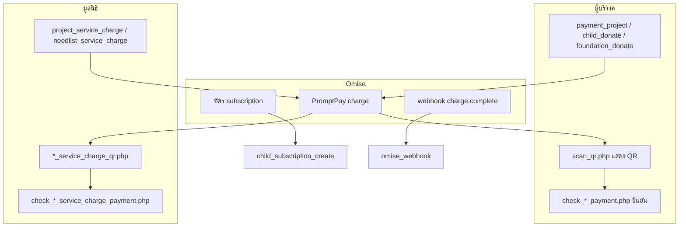

# คู่มืออ่านโค้ด — โฟลเดอร์ `payment/` ทุกไฟล์

เอกสารสำหรับอ่านทีละไฟล์ตามลำดับชื่อในโฟลเดอร์ (เรียง A–Z) รูปแบบเดียวกับ [`drawdream-features-code-walkthrough.md`](drawdream-features-code-walkthrough.md) และ [`includes-code-walkthrough.md`](includes-code-walkthrough.md)

**อ่านแบบ Flow ตามธุรกิจ:** [`drawdream-flow-walkthrough.md`](drawdream-flow-walkthrough.md) (เด็ก / โครงการ / สิ่งของ)

Helper ที่ payment เรียกใช้: ดู [`includes-flow-walkthrough.md`](includes-flow-walkthrough.md) (Flow 4) หรือรายละเอียดโค้ดใน [`includes-code-walkthrough.md`](includes-code-walkthrough.md) (`e_receipt.php`, `qr_payment_abandon.php`, `child_omise_subscription.php` ฯลฯ)

---

## ภาพรวม Flow ชำระเงิน



---

## สารบัญ (เรียงชื่อไฟล์)

| # | ไฟล์ | หน้าที่สั้น |
|---|------|-------------|
| 1 | `abandon_qr.php` | ยกเลิก QR ค้าง |
| 2 | `cacert.pem` | ใบรับรอง SSL สำหรับ cURL |
| 3 | `check_child_payment.php` | ยืนยันบริจาคเด็ก |
| 4 | `check_needlist_payment.php` | ยืนยันบริจาคสิ่งของ |
| 5 | `check_needlist_service_charge_payment.php` | ยืนยันค่าบริการสิ่งของ |
| 6 | `check_project_payment.php` | ยืนยันบริจาคโครงการ |
| 7 | `check_project_service_charge_payment.php` | ยืนยันค่าบริการโครงการ |
| 8 | `child_donate.php` | สร้าง charge เด็ก → QR |
| 9 | `child_subscription_cancel.php` | ยกเลิกอุปการะบัตร |
| 10 | `child_subscription_create.php` | สมัครอุปการะ Omise |
| 11 | `config.php` | คีย์ Omise + โหมด test/live |
| 12 | `cron_child_subscription_charges.php` | cron หักรอบ subscription |
| 13 | `donate_qr.php` | QR บริจาคระบบ (homepage) |
| 14 | `foundation_donate.php` | บริจาคสิ่งของ → QR |
| 15 | `needlist_service_charge.php` | สร้าง QR ค่าบริการสิ่งของ |
| 16 | `needlist_service_charge_qr.php` | แสดง QR ค่าบริการสิ่งของ |
| 17 | `omise_helpers.php` | HTTP ดึง charge / QR URI |
| 18 | `omise_webhook.php` | webhook จาก Omise |
| 19 | `payment_project.php` | บริจาคโครงการ → QR |
| 20 | `project_service_charge.php` | สร้าง QR ค่าบริการโครงการ |
| 21 | `project_service_charge_qr.php` | แสดง QR ค่าบริการโครงการ |
| 22 | `run_subscription_cron.bat` | รัน cron บน Windows |
| 23 | `scan_qr.php` | หน้า QR กลาง (project/child/foundation) |
| 24 | `system_donate.php` | ฟอร์มเลือกยอด → donate_qr |

---

# 1. abandon_qr.php

**บทบาท:** ผู้บริจาคกดยกเลิกขณะรอสแกน QR — ปิด charge ที่ Omise + ลบ pending + ล้าง session

```21:42:payment/abandon_qr.php
$uid = (int)$_SESSION['user_id'];
$chargeId = trim((string)($_POST['charge_id'] ?? ''));
// ...
if ($chargeId !== '') {
    drawdream_abandon_pending_donation_by_charge($conn, $uid, $chargeId);
}
drawdream_clear_pending_payment_session();
header('Location: ' . $return);
```

### อธิบาย

รับ **POST** จากปุ่มยกเลิกบน `scan_qr.php` / `check_*_payment.php` **Input:** `charge_id`, session `pending_*`

ลำดับใน `includes/qr_payment_abandon.php`:

1. **Omise** `POST /charges/{id}/expire` ผ่าน `drawdream_omise_expire_pending_charge()` — ปิด QR PromptPay ที่ยัง `pending` (ไม่ใช่ void/refund)
2. **DELETE** แถว `donation` ที่ `payment_status = 'pending'` และ `omise_charge_id` ตรง (ยังทำแม้ expire ล้มเหลว — log ใน error_log)
3. `drawdream_clear_pending_payment_session()` แล้ว redirect กลับ `children_donate.php`, `project.php` หรือ `foundation.php`

| สถานการณ์ | พฤติกรรม |
|-----------|----------|
| ยังไม่โอน | expire + ลบ pending → สร้าง QR ใหม่ได้ |
| โอนสำเร็จแล้ว | อย่ากดยกเลิก — ใช้ «ยืนยันการชำระ» / webhook |
| ชำระแล้วแต่เป้าเต็ม (โครงการ/สิ่งของ) | คืนเงินผ่าน `drawdream_omise_refund_charge()` ใน finalize แยกต่างหาก |

**หมายเหตุ:** PromptPay ที่ Omise ระบุว่า **ไม่ void/refund ผ่าน API ทั่วไป** — การยกเลิกก่อนจ่ายใช้ **expire** เท่านั้น

---

# 2. cacert.pem

**บทบาท:** ไฟล์ใบรับรอง CA (Mozilla bundle) สำหรับ cURL เชื่อม `api.omise.co` บน Windows/dev

### อธิบาย

ไม่ใช่โค้ด PHP — `config.php` และ `omise_helpers.php` ชี้ `OMISE_CURL_CAINFO` มาที่ไฟล์นี้เมื่อ PHP ไม่มี CA ในระบบ ช่วยแก้ SSL certificate problem ตอนเรียก Omise

---

# 3. check_child_payment.php

**บทบาท:** หลังสแกน QR เด็ก — ดึงสถานะ charge จาก Omise แล้ว finalize donation

```173:178:payment/check_child_payment.php
if ($finalized_this_request && $receiptDonateId <= 0) {
    $receiptDonateId = drawdream_receipt_completed_donation_id_by_charge($conn, $charge_id);
}
if ($finalized_this_request && $receiptDonateId > 0) {
    drawdream_send_e_receipt_notification_by_donate_id($conn, $receiptDonateId);
}
```

### อธิบาย

**Input:** `GET charge_id`, `child_id`, session `pending_charge_id` เรียก `drawdream_omise_fetch_charge` (ผ่าน `omise_helpers.php`) ถ้า `paid` / `successful` จะ `drawdream_finalize_child_donation` → **UPDATE** `donation` เป็น `completed`, sync อุปการะ, ส่งใบเสร็จ (`e_receipt.php`) กันซ้ำด้วยเช็ก `omise_charge_id` + `payment_status` ก่อน INSERT **Storage:** `donation`, `foundation_children` (ยอด/สถานะ)

---

# 4. check_needlist_payment.php

**บทบาท:** ยืนยันบริจาครายการสิ่งของหลัง PromptPay

### อธิบาย

Flow คล้าย `check_child_payment.php` แต่ **target** คือ `foundation_needlist.item_id` เมื่อสำเร็จ: **INSERT/UPDATE** `donation`, เพิ่ม `current_donate` บน needlist, เรียก `drawdream_needlist_sync_service_charge_for_item` ถ้าครบเป้า, ส่งใบเสร็จให้ผู้บริจาค รองรับ mock charge ตอน dev (`_omise_local_mock` ใน `foundation_donate.php`)

---

# 5. check_needlist_service_charge_payment.php

**บทบาท:** มูลนิธิสแกนจ่ายค่าบริการ 5% รายการสิ่งของ

### อธิบาย

**Input:** `charge_id`, `item_id` หลัง Omise สำเร็จ **UPDATE** `foundation_needlist.service_charge_paid_at = NOW()` ไม่ส่งใบเสร็จให้มูลนิธิ (exclude ใน `e_receipt.php`) แอดมินถึงจะเริ่มจัดซื้อได้ใน `admin_escrow.php` มี `needlist_sc_respond` คืน JSON หรือ redirect ตาม polling จากหน้า QR

---

# 6. check_project_payment.php

**บทบาท:** ยืนยันบริจาคโครงการ — บันทึก donation, escrow, ค่าบริการ, ใบเสร็จ

```270:301:payment/check_project_payment.php
INSERT INTO donation (...) VALUES (..., 'completed', ..., ?, 'project');
drawdream_project_bump_and_maybe_complete($conn, $project_id, $amount);
drawdream_escrow_funds_try_insert_holding_for_target(...);
// ...
drawdream_send_e_receipt_notification_by_donate_id($conn, $receiptDonateId);
```

### อธิบาย

ใน transaction: **INSERT** `donation` (`donate_type = project`), เพิ่ม `foundation_project.current_donate` (ไม่เกิน `goal_amount`), **INSERT** `escrow_funds` holding, เรียก `drawdream_project_sync_service_charge_for_project` เมื่อครบเป้า แล้วแจ้งใบเสร็จอิเล็กทรอนิกส์ กัน double-submit ด้วยเช็ก charge ซ้ำ

---

# 7. check_project_service_charge_payment.php

**บทบาท:** ยืนยันมูลนิธิชำระค่าบริการโครงการ 5%

### อธิบาย

คล้ายข้อ 5 แต่ **UPDATE** `foundation_project.service_charge_paid_at` ปลดล็อกให้แอดมิน `confirm_transfer` ใน escrow ได้

---

# 8. child_donate.php

**บทบาท:** POST รับยอดบริจาคเด็ก → สร้าง Omise PromptPay charge → ไป `scan_qr.php`

```57:80:payment/child_donate.php
function omise_request(string $method, string $path, array $data = []): array {
    // curl ไป OMISE_API_URL + path, Authorization skey
}
function _omise_local_mock_child(string $path, array $data): array {
    // fallback เมื่อ OMISE_ALLOW_LOCAL_MOCK / HTTPS ล้ม
}
```

### อธิบาย

**Input:** POST จำนวนเงิน, `child_id` สร้าง charge ผ่าน Omise (หรือ mock) เก็บ `pending_charge_id`, `pending_child_id`, `pending_amount` ใน **session** เรียก `drawdream_insert_pending_child_donation` → **INSERT** `donation` สถานะ `pending` redirect `scan_qr.php?type=child&charge_id=...`

---

# 9. child_subscription_cancel.php

**บทบาท:** ผู้บริจาคยกเลิกแผนอุปการะรายรอบ

```65:97:payment/child_subscription_cancel.php
if ($scheduleId !== '' && str_starts_with($scheduleId, 'schd_')) {
    drawdream_omise_post_form('/schedules/' . rawurlencode($scheduleId) . '/revoke', []);
}
UPDATE child_subscription_history SET current_status = 'cancelled' ...
drawdream_child_sync_sponsorship_status($conn, $childId);
```

### อธิบาย

รายละเอียดเต็มใน [`drawdream-features-code-walkthrough.md` ข้อ 1.3](drawdream-features-code-walkthrough.md#13-ยกเลิกอุปการะ--สถานะ-รออุปการะ)

---

# 10. child_subscription_create.php

**บทบาท:** สมัครอุปการะด้วยบัตร — Omise Customer, Schedule หรือ fallback หักรอบแรก + cron

```262:328:payment/child_subscription_create.php
$sres = drawdream_omise_post_schedule(...);
if (($sres['object'] ?? '') === 'error') {
    $fcharge = drawdream_omise_create_card_charge(...);
    $localSchId = 'local_cron_' . bin2hex(random_bytes(12));
    INSERT INTO donation (...) -- รอบแรก completed
    drawdream_child_subscription_history_log(..., 'active', ...);
}
drawdream_send_e_receipt_notification_by_donate_id($conn, $firstDonateId);
```

### อธิบาย

**Input:** POST `omiseToken`, `plan`, `child_id` สร้าง/ผูก customer ที่ `donor` พยายาม `POST /schedules` ถ้าไม่ได้ (บัญชี test มักบล็อก) → หัก charge รอบแรก + `local_cron_*` สำหรับ `cron_child_subscription_charges.php` รายละเอียดใน walkthrough ข้อ 1.4

---

# 11. config.php

**บทบาท:** คอนฟิกกลาง Omise — คีย์, URL, mock, cron secret

```32:48:payment/config.php
define('OMISE_PUBLIC_KEY', 'pkey_test_...');
define('OMISE_SECRET_KEY', 'skey_test_...');
define('OMISE_API_URL', 'https://api.omise.co');
define('OMISE_ALLOW_LOCAL_MOCK', false);
```

### อธิบาย

ทุกไฟล์ใน `payment/` include ไฟล์นี้ก่อนเรียก API **Test key** (`pkey_test_` / `skey_test_`) = ไม่ตัดเงินจริง แต่ charge ขึ้น Omise Dashboard ได้ **Live key** ใช้บน production — ควรย้ายไป env ไม่ commit คีย์จริง `DRAWDREAM_SUBSCRIPTION_CRON_SECRET` ใช้ป้องกันการเรียก cron ผ่าน HTTP

---

# 12. cron_child_subscription_charges.php

**บทบาท:** หักบัตรรอบถัดไปของแผน `local_cron_*`

```31:38:payment/cron_child_subscription_charges.php
SELECT ... FROM child_subscription_history h
 WHERE h.current_status = 'active'
   AND h.recurring_schedule_id LIKE 'local_cron_%'
```

### อธิบาย

รัน **CLI** หรือ `?secret=` ตาม `config.php` อ่านแผนที่ `recurring_next_charge_at <= วันนี้` เรียก `drawdream_omise_create_card_charge` แล้ว **INSERT** `donation` รอบใหม่ + อัปเดตวันหักถัดไป + ใบเสร็จ ไม่ใช่การส่งคำสั่งหักทุกเดือนในครั้งเดียว — หักทีละรอบเมื่อถึงกำหนด

---

# 13. donate_qr.php

**บทบาท:** แสดง QR สถิติบริจาคระบบ (จาก homepage) — ไม่ผ่าน Omise API แบบ dynamic

```17:20:payment/donate_qr.php
$amountLabel = $amount >= 20
    ? number_format($amount, 0) . ' บาท'
    : 'ตามจำนวนที่โอน';
```

### อธิบาย

**Input:** `GET amount` จาก `homepage.php` หรือ `system_donate.php` แสดงรูป QR จาก `img/qr-code.png` (static) + ยอดที่เลือก ปุ่ม «ยืนยันการบริจาค» กลับ homepage — **ไม่มี** `check_*_payment` บันทึก Omise อัตโนมัติ (ต่างจาก flow โครงการ/เด็ก/สิ่งของ)

---

# 14. foundation_donate.php

**บทบาท:** หน้าเลือกรายการสิ่งของ + สร้าง charge PromptPay (~732 บรรทัด)

```195:210:payment/foundation_donate.php
function drawdream_build_need_catalog(array $items): array
{
    // รวมรายการ needlist ที่เปิดรับบริจาคเป็น catalog สำหรับ UI
}
```

### อธิบาย

**READ** `foundation_needlist` ที่ผ่านเงื่อนไข `drawdream_needlist_sql_open_for_donation` ผู้บริจาคเลือกรายการและยอด สร้าง Omise charge (ฟังก์ชัน `omise_request` / mock ในไฟล์เดียวกับ needlist) เก็บ session `pending_foundation_id`, `pending_item_id` ฯลฯ redirect `scan_qr.php?type=foundation` มี JavaScript ช่วยเลือก preset ยอดและ validate

---

# 15. needlist_service_charge.php

**บทบาท:** มูลนิธิเริ่มชำระค่าบริการ 5% รายการสิ่งของ — สร้าง charge

### อธิบาย

**Input:** `item_id` **READ** `service_charge` จาก `foundation_needlist` สร้าง Omise charge ยอดตรงค่าบริการ เก็บ session แล้วไป `needlist_service_charge_qr.php` ใช้ `donate_type` ค่าบริการมูลนิธิ

---

# 16. needlist_service_charge_qr.php

**บทบาท:** แสดง QR + polling ไป `check_needlist_service_charge_payment.php`

### อธิบาย

เลย์เอาต์การ์ดสีน้ำเงิน แสดงยอดค่าบริการ ชื่อรายการ JavaScript poll สถานะ charge จนสำเร็จหรือผู้ใช้ยกเลิก

---

# 17. omise_helpers.php

**บทบาท:** HTTP client กลางดึง charge และ URI รูป PromptPay

```295:332:payment/omise_helpers.php
function drawdream_omise_fetch_charge(string $chargeId): ?array
function drawdream_omise_promptpay_qr_uri_from_charge(?array $charge): string
```

### อธิบาย

ใช้ร่วมกับ `payment_project.php`, `scan_qr.php`, `check_*_payment.php` รองรับ cURL, SSL socket fallback, แปลง error เป็นข้อความไทย (`drawdream_omise_error_for_human`) ดึง `source.scannable_code.image.download_uri` สำหรับแสดง QR จริงจาก Omise

---

# 18. omise_webhook.php

**บทบาท:** endpoint รับ event จาก Omise (server-to-server)

```198:201:payment/omise_webhook.php
$receiptDonateId = drawdream_receipt_completed_donation_id_by_charge($conn, $chargeId);
if ($receiptDonateId > 0) {
    drawdream_send_e_receipt_notification_by_donate_id($conn, $receiptDonateId);
}
```

### อธิบาย

**Input:** raw JSON body + signature header ตรวจ `drawdream_webhook_verify_signature_and_time` กัน replay ด้วย event id ไฟล์ cache เมื่อ `charge.complete` สำหรับ subscription เรียก `drawdream_child_persist_subscription_paid_charge` บันทึก `donation` + history แล้วส่งใบเสร็จ — สำรองกรณีผู้ใช้ไม่กลับมาที่ `check_*_payment.php`

---

# 19. payment_project.php

**บทบาท:** หน้าชำระโครงการ — ฟอร์มยอด + สร้าง PromptPay charge (~671 บรรทัด)

```33:57:payment/payment_project.php
$stmt = $conn->prepare("
    SELECT p.*, fp.phone, u.email ...
    FROM foundation_project p
    WHERE p.project_id = ? AND p.project_status IN ('approved', 'completed', 'done') ...
");
$donationStartEff = drawdream_project_effective_donation_start($project);
```

### อธิบาย

เช็ก login, วันสิ้นสุดโครงการ, วันเริ่มรับบริจาค POST ยอด → สร้าง Omise source+charge → `drawdream_insert` pending donation → session → `scan_qr.php?type=project` มี JS จำกัดยอดไม่เกินยอดที่เหลือของเป้า

---

# 20. project_service_charge.php

**บทบาท:** มูลนิธิสร้าง charge ค่าบริการโครงการ 5%

### อธิบาย

คล้าย `needlist_service_charge.php` แต่ใช้ `foundation_project.service_charge` หลังครบเป้า redirect ไป `project_service_charge_qr.php`

---

# 21. project_service_charge_qr.php

**บทบาท:** แสดง QR ค่าบริการโครงการ + poll `check_project_service_charge_payment.php`

### อธิบาย

โครงสร้างเดียวกับ `needlist_service_charge_qr.php` ต่าง target เป็น `project_id`

---

# 22. run_subscription_cron.bat

**บทบาท:** สคริปต์ Windows เรียก `php cron_child_subscription_charges.php`

### อธิบาย

ใช้กับ Task Scheduler บนเครื่อง dev/server Windows ให้หักรอบ subscription ตามเวลา (แนะนำครอบ 08:00 น. ไทย)

---

# 23. scan_qr.php

**บทบาท:** หน้า QR กลางหลังสร้าง charge — โครงการ / เด็ก / สิ่งของ

```19:38:payment/scan_qr.php
$charge_id = trim((string)($_GET['charge_id'] ?? ($_SESSION['pending_charge_id'] ?? '')));
if (!isset($_SESSION['pending_charge_id']) || $_SESSION['pending_charge_id'] !== $charge_id) {
    $qr_fail('../project.php');
}
```

```53:75:payment/scan_qr.php
if ($type === 'project') {
    $confirm_href = 'check_project_payment.php?charge_id=' . urlencode($charge_id) . '&project_id=' . $project_id;
} elseif ($type === 'child') {
    $confirm_href = 'check_child_payment.php?...';
}
```

### อธิบาย

**Input:** `type`, `charge_id`, session ต้องตรงกัน (กันป้อน URL ข้ามคน) ดึงภาพ QR จาก Omise ผ่าน `omise_helpers` หรือ session `qr_image` มีปุ่ม «ตรวจสอบการชำระ» ลิงก์ไป `check_*_payment.php` ที่เหมาะ และฟอร์ม POST ไป `abandon_qr.php` JavaScript อาจ poll charge สถานะระหว่างรอ

---

# 24. system_donate.php

**บทบาท:** ฟอร์มเลือกยอดบริจาคค่าบริหารระบบ (ไม่ผ่าน Omise dynamic)

```8:14:payment/system_donate.php
if ($_SERVER['REQUEST_METHOD'] === 'POST') {
    if ($amount < 20) {
        $error = 'จำนวนเงินขั้นต่ำ 20 บาท';
    } else {
        header('Location: donate_qr.php?amount=' . urlencode((string)$amount));
        exit();
    }
}
```

### อธิบาย

หน้า standalone สำหรับบริจาค DrawDream โดยตรง — preset 20/50/100 บาท หรือกรอกเอง ส่งต่อ `donate_qr.php` ไม่สร้าง `donation` ใน DB อัตโนมัติ

---

## ตารางไฟล์ → ตาราง DB หลัก

| ไฟล์กลุ่ม | ตารางที่แตะบ่อย |
|-----------|----------------|
| `check_project_payment` | `donation`, `foundation_project`, `escrow_funds` |
| `check_child_payment` | `donation`, `foundation_children` |
| `check_needlist_payment` | `donation`, `foundation_needlist` |
| `check_*_service_charge_*` | `foundation_project` / `foundation_needlist` (`service_charge_paid_at`) |
| `child_subscription_*` | `donation`, `donor`, `child_subscription_history` |
| `omise_webhook` | `donation`, `child_subscription_history` |

---

## Session keys ที่ใช้ร่วมกัน (QR flow)

| Session key | ความหมาย |
|-------------|----------|
| `pending_charge_id` | รหัส Omise charge |
| `pending_amount` | ยอดบาท |
| `pending_project_id` | โครงการ |
| `pending_child_id` | เด็ก |
| `pending_foundation_id` / `pending_item_id` | สิ่งของ |
| `qr_image` | URI รูป QR (cache) |

ล้างด้วย `drawdream_clear_pending_payment_session()` ใน `abandon_qr.php` และหลังชำระสำเร็จ

---

*อัปเดตตาม `payment/` ใน repo DrawDream — 24 รายการ (22 PHP + cacert + bat)*
