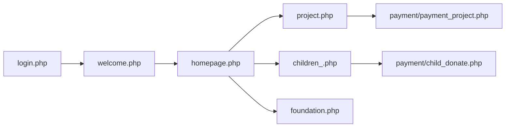

# คู่มืออ่านโค้ด — ไฟล์ PHP รากโปรเจกต์ (ทุกไฟล์ในภาพ)

เอกสารอ่านทีละไฟล์ตามลำดับชื่อ (A–Z) รูปแบบเดียวกับ [`drawdream-features-code-walkthrough.md`](drawdream-features-code-walkthrough.md)

**อ่านแบบ Flow:** [`drawdream-flow-walkthrough.md`](drawdream-flow-walkthrough.md) · [`includes-flow-walkthrough.md`](includes-flow-walkthrough.md)

**โฟลเดอร์ย่อย:** [`includes-code-walkthrough.md`](includes-code-walkthrough.md) · [`payment-code-walkthrough.md`](payment-code-walkthrough.md)

---

## บทบาทตาม prefix

| Prefix | ใครใช้ | หน้าที่หลัก |
|--------|--------|-------------|
| `admin_*` | แอดมิน | อนุมัติ, ดูรายการ, escrow, รายงาน |
| `foundation_*` | มูลนิธิ | เพิ่มเด็ก/โครงการ/สิ่งของ, โพสต์ผล, dashboard |
| `children_*` | ผู้บริจาค + มูลนิธิ | รายการเด็ก, บริจาค/อุปการะ |
| `project_*` | ทุก role | รายการโครงการ, ผลลัพธ์ |
| อื่น | ทุกคน | login, homepage, navbar, ใบเสร็จ |



---

## สารบัญ (76 ไฟล์ PHP + ไฟล์เสริม)

| # | ไฟล์ |
|---|------|
| 1–76 | `about.php` … `welcome.php` (ดูหัวข้อด้านล่างตามลำดับชื่อ) |
| — | `README.md`, `run_dev_server.bat`, `run_dev_server.ps1` |

---

# 1. about.php

**บทบาท:** หน้าเกี่ยวกับเรา / FAQ สาธารณะ

### อธิบาย

หน้า HTML สถิติ ไม่มี logic ฐานข้อมูลซับซ้อน — อธิบาย DrawDream ให้ผู้เยี่ยมชม `session_start()` เพื่อใช้ navbar ร่วมกับส่วนอื่น

---

# 2. account.php

**บทบาท:** ทางแยกหลังล็อกอิน — ส่งต่อตาม role

```13:28:account.php
$role = $_SESSION['role'] ?? 'donor';
if ($role === 'foundation') {
    header("Location: foundation.php");
} elseif ($role === 'admin') {
    header('Location: admin_dashboard.php');
}
header("Location: welcome.php");
```

### อธิบาย

ไม่แสดง UI — เป็น **router** หลัง `login.php` ตั้ง session แล้ว: มูลนิธิ → `foundation.php`, แอดมิน → `admin_dashboard.php`, ผู้บริจาค → `welcome.php`

---

# 3. admin_approve_children.php

**บทบาท:** แอดมินอนุมัติ/ปฏิเสธโปรไฟล์เด็ก

### อธิบาย

**READ** `foundation_children` ที่ `approve_profile` รอดำเนินการ **POST** อนุมัติ → **UPDATE** `approve_profile = 'อนุมัติ'` หรือปฏิเสธพร้อมเหตุผล เรียก `drawdream_log_admin_action` และแจ้งเตือนมูลนิธิ (`notification_audit.php`) รายละเอียดเด็กใน walkthrough ข้อ 1.1

---

# 4. admin_approve_foundation.php

**บทบาท:** แอดมินอนุมัติบัญชีมูลนิธิ (`account_verified`)

### อธิบาย

**UPDATE** `foundation_profile.account_verified` หลังตรวจเอกสาร — มูลนิธิถึงจะใช้ `drawdream_foundation_require_account_verified` ผ่านได้ อาจบันทึก `review_note` ผ่าน `foundation_review_schema`

---

# 5. admin_approve_needlist.php

**บทบาท:** แอดมินอนุมัติรายการสิ่งของ + ปรับราคา

### อธิบาย

**POST** อนุมัติ → **UPDATE** `approve_item`, ราคาใน `need_items_pricing_json`, `total_price`, ตั้ง `donate_window_end_at` ผ่าน `needlist_donate_window.php` ปฏิเสธ → `approve_item = 'rejected'` ดู [`needlist-features-code-walkthrough.md`](needlist-features-code-walkthrough.md)

---

# 6. admin_approve_projects.php

**บทบาท:** แอดมินอนุมัติ/ปฏิเสธโครงการ (UI คล้าย `children_donate`)

### อธิบาย

**UPDATE** `foundation_project.project_status` เป็น `approved` หรือ `rejected` หลังอนุมัติผู้บริจาคบริจาคได้ผ่าน `payment/payment_project.php`

---

# 7. admin_child_donations.php

**บทบาท:** แอดมินดูยอดบริจาคเด็กแยกรายการ (ตาราง donation)

### อธิบาย

**READ** `donation` join `foundation_children` กรองหมวดเด็ก แสดงรายการชำระ, ยอด, `donate_type` ใช้ `child_sponsorship.php` ช่วยแสดงบริบทอุปการะ

---

# 8. admin_children.php

**บทบาท:** แอดมินจัดการรายการเด็กทั้งระบบ

### อธิบาย

**SELECT** `foundation_children` กรองสถานะอนุมัติ ลิงก์ไป `admin_view_child.php`, `admin_approve_children.php` อาจลบ/ซ่อนเด็ก (soft delete)

---

# 9. admin_children_overview.php

**บทบาท:** redirect ไป `children_.php` (มุมมองแอดมิน)

### อธิบาย

ไฟล์สั้น — **redirect** เท่านั้น รักษา URL เก่าให้ใช้หน้ารายการเด็กแบบเดียวกับสาธารณะแต่ role admin

---

# 10. admin_dashboard.php

**บทบาท:** แดชบอร์ดแอดมิน — KPI, กราฟ, ยอดค้ำ

```60:61:admin_dashboard.php
// ยอดเงินพักโครงการ (escrow_funds.holding)
```

### อธิบาย

**READ** สรุปจำนวนมูลนิธิ/เด็ก/โครงการรออนุมัติ, ยอดบริจาครวม, ยอด **escrow** จาก `drawdream_escrow_project_holding_total_display` กราฟ 30 วันโหลดจาก `admin_dashboard_chart_data.php` (AJAX JSON)

---

# 11. admin_dashboard_chart_data.php

**บทบาท:** API JSON สำหรับกราฟแดชบอร์ด

### อธิบาย

**Output:** JSON ชุดข้อมูลรายวัน — เรียกจาก JavaScript ใน `admin_dashboard.php` ต้อง login แอดมิน

---

# 12. admin_donor_email.php

**บทบาท:** แอดมินส่งอีเมลถึงผู้บริจาค (เช่นแจ้งข่าว)

### อธิบาย

**POST** ข้อความ + ผู้รับ **READ** `user`/`donor` ส่งผ่านเมล (PHPMailer หรือ mail()) — ไม่เกี่ยว Omise

---

# 13. admin_donors.php

**บทบาท:** ภาพรวมผู้บริจาค — ยอดสะสม, ความถี่

### อธิบาย

**READ** aggregate จาก `donation` + `user` แสดงตารางผู้บริจาคทั้งระบบ ลิงก์ดูประวัติบริจาค

---

# 14. admin_escrow.php

**บทบาท:** จัดการเงินค้ำ — ยืนยันโอน, จัดซื้อสิ่งของ, อัปโหลดหลักฐานจัดส่ง

```39:63:admin_escrow.php
if ($action === 'confirm_transfer' && $project_id) {
  // เช็ค service_charge_paid_at ก่อน
  UPDATE foundation_project SET project_status = 'purchasing'
  drawdream_escrow_funds_release_holding_for_project(...)
}
```

### อธิบาย

ศูนย์กลางหลังครบเป้า: มูลนิธิชำระค่าบริการ → แอดมิน `confirm_transfer` / `start_purchase` / `upload_evidence` รายละเอียดใน walkthrough ข้อ 2.2 และ 3.3

---

# 15. admin_foundation_analytics_pdf.php

**บทบาท:** ส่งออกรายงาน analytics มูลนิธิเป็น PDF

### อธิบาย

ใช้ HTML จาก `foundation_analytics_report_html.php` แปลง PDF (TCPDF หรือพิมพ์) สำหรับแอดมินดูรายมูลนิธิ

---

# 16. admin_foundation_analytics_view.php

**บทบาท:** หน้าเว็บแสดงรายงาน analytics มูลนิธิ + ปุ่มพิมพ์ PDF

### อธิบาย

**Input:** `foundation_id` **READ** ผ่าน `foundation_analytics.php` แสดง KPI, retention อุปการะ, หมวดยอดนิยม

---

# 17. admin_foundation_totals.php

**บทบาท:** ยอดบริจาคแยกมูลนิธิ (เด็ก / โครงการ / สิ่งของ)

### อธิบาย

**READ** `donation` รวมตาม `foundation_name` หรือ `foundation_id` แสดงตารางเปรียบเทียนมูลนิธิ

---

# 18. admin_foundations_overview.php

**บทบาท:** ภาพรวมมูลนิธิทั้งระบบ

### อธิบาย

**SELECT** `foundation_profile` สถานะอนุมัติ, จำนวนเด็ก/โครงการ ลิงก์ `admin_view_foundation.php`

---

# 19. admin_needlist_directory.php

**บทบาท:** ตารางรายการสิ่งของทั้งระบบ (มุมแอดมิน)

### อธิบาย

**READ** `foundation_needlist` ทุกสถานะ `approve_item` กรอง/ค้นหา ลิงก์ `admin_needlist_view.php`, `admin_approve_needlist.php`

---

# 20. admin_needlist_totals.php

**บทบาท:** ยอดบริจาครายการสิ่งของเดียว + แยกรายการชำระ

### อธิบาย

**Input:** `item_id` **READ** `donation` ที่ `target_id` = รายการนั้น แสดงผู้บริจาคแต่ละคนและยอด

---

# 21. admin_needlist_view.php

**บทบาท:** ดูรายละเอียดสิ่งของหนึ่งรายการ (แอดมิน)

### อธิบาย

**READ** แถว needlist + JSON รายการย่อย + รูป ปุ่มไปอนุมัติ/แก้ราคา ถ้ายัง `pending`

---

# 22. admin_notifications.php

**บทบาท:** ศูนย์รวมงานรออนุมัติ — ลิงก์คิว

### อธิบาย

**READ** นับ/ลิงก์ไป มูลนิธิรออนุมัติ, เด็ก, โครงการ, สิ่งของ pending ใช้ `drawdream_sql_project_is_pending` สอดคล้อง `navbar.php`

---

# 23. admin_project_totals.php

**บทบาท:** ยอดบริจาคโครงการเดียว + รายการ donation

### อธิบาย

คล้าย `admin_needlist_totals.php` แต่ **target** เป็น `foundation_project.project_id`

---

# 24. admin_projects.php

**บทบาท:** จัดการโครงการทั้งระบบ (แอดมิน)

### อธิบาย

**SELECT** `foundation_project` กรองสถานะ ลิงก์อนุมัติ/ดูรายละเอียด

---

# 25. admin_projects_directory.php

**บทบาท:** ไดเรกทอรีโครงการแบบตาราง

### อธิบาย

มุมมองสาธารณะ+แอดมิน รวมทุกโครงการที่อนุมัติแล้ว กรองจังหวัดจาก `location`

---

# 26. admin_view_child.php

**บทบาท:** ดูโปรไฟล์เด็กฉบับเต็ม (แอดมิน)

### อธิบาย

**READ** `foundation_children` รูป, ความฝัน, สถานะอุปการะ, ประวัติบริจาค ปุ่มอนุมัติ/ปฏิเสธ

---

# 27. admin_view_foundation.php

**บทบาท:** ดูโปรไฟล์มูลนิธิ (แอดมิน)

### อธิบาย

**READ** `foundation_profile` + รายการเด็ก/โครงการ/สิ่งของของมูลนิธินั้น

---

# 28. admin_view_needlist.php

**บทบาท:** ดูรายการสิ่งของแบบละเอียด (แอดมิน)

### อธิบาย

คล้าย `foundation_need_view.php` แต่สิทธิ์แอดมิน — แก้ราคา/อนุมัติได้

---

# 29. admin_view_project.php

**บทบาท:** ดูโครงการฉบับเต็ม (แอดมิน)

### อธิบาย

**READ** `foundation_project`, ยอดบริจาค, ผลลัพธ์, สถานะ escrow

---

# 30. children_.php

**บทบาท:** รายการเด็กสาธารณะ + มูลนิธิจัดการเด็กของตัวเอง

### อธิบาย

**READ** `foundation_children` ที่อนุมัติแล้ว แสดงการ์ดเด็ก, สถานะอุปการะ (`child_sponsorship.php`) มูลนิธิเห็นเฉพาะเด็กของตัวเอง ลิงก์ `children_donate.php`, `foundation_add_children.php`

---

# 31. children_donate.php

**บทบาท:** หน้าบริจาค/อุปการะเด็กคนหนึ่ง

### อธิบาย

**Input:** `GET id` = `child_id` แสดงโปรไฟล์, ปุ่ม PromptPay → `payment/child_donate.php`, ปุ่มบัตรรายรอบ → ฟอร์ม Omise → `payment/child_subscription_create.php` แสดงผลลัพธ์/ผู้อุปการะจาก helper อุปการะ

---

# 32. db.php

**บทบาท:** เชื่อมต่อ MySQL + bootstrap migration ทุก request

```15:16:db.php
require_once __DIR__ . '/includes/env_loader.php';
drawdream_load_env_file(__DIR__ . '/.env');
```

### อธิบาย

**Output:** ตัวแปร `$conn` (mysqli) อ่าน config จาก `config/db.local.php` หรือ env จากนั้นเรียก migration: `drawdream_project_status`, `drawdream_soft_delete`, `drawdream_needlist_schema`, `notification_audit` ฯลฯ — เกือบทุกหน้า `include 'db.php'`

---

# 33–35. detail_alin.php, detail_pin.php, detail_san.php

**บทบาท:** หน้าเรื่องราวตัวอย่าง (สตอรี่เด็ก) — เนื้อหาสถิติ

### อธิบาย

หน้า PR/ตัวอย่าง ไม่ผูก `foundation_children` ใน DB — ใช้ดึงดูดผู้บริจาคบน homepage

---

# 36. donation_receipt.php

**บทบาท:** ใบเสร็จอิเล็กทรอนิกส์ HTML (พิมพ์เป็น PDF ได้)

```511:511:donation_receipt.php
<button type="button" class="btn btn-print" onclick="window.print()">พิมพ์ / บันทึก PDF</button>
```

### อธิบาย

**Input:** `GET donate_id` **READ** `donation` completed ตรวจสิทธิ์ donor/admin สร้างเลขที่ `DD-YYYYMMDD-0000123` ไม่สร้างไฟล์ PDF บนเซิร์ฟเวอร์ — ดูคำอธิบายใบเสร็จใน walkthrough ข้อ 4

---

# 37. donor_update_profile.php

**บทบาท:** ผู้บริจาคแก้โปรไฟล์ (ภาษี, นิติบุคคลสำหรับใบเสร็จ)

### อธิบาย

**UPDATE** `donor` — `tax_id`, `receipt_type`, `receipt_company_*` ใช้ตอนแสดง `donation_receipt.php` โหมดบุคคล/นิติบุคคล

---

# 38. foundation.php

**บทบาท:** หน้าหลักมูลนิธิหลังล็อกอิน — เมนูงาน, สรุป, ลิงก์ฟีเจอร์

### อธิบาย

Hub สำหรับมูลนิธิ: เพิ่มเด็ก, โครงการ, สิ่งของ, แจ้งเตือน, analytics เรียก `drawdream_foundation_require_account_verified` ถ้ายังไม่ผ่านอนุมัติบัญชี

---

# 39. foundation_add_children.php

**บทบาท:** เพิ่ม/แก้โปรไฟล์เด็ก

### อธิบาย

Walkthrough ข้อ 1.1 — อายุจากวันเกิด, **INSERT/UPDATE** `foundation_children`

---

# 40. foundation_add_need.php

**บทบาท:** เสนอรายการสิ่งของ

### อธิบาย

Walkthrough ข้อ 3.2 — ราคา×จำนวน, **INSERT** `foundation_needlist`

---

# 41. foundation_add_project.php

**บทบาท:** เพิ่ม/แก้โครงการ + ที่อยู่

### อธิบาย

Walkthrough ข้อ 2.1 — `drawdream_merge_foundation_address_from_post`, **INSERT** `foundation_project`

---

# 42. foundation_analytics_report.php

**บทบาท:** มูลนิธิดูรายงานสถิติของตัวเอง (เว็บ)

### อธิบาย

**READ** ผ่าน `foundation_analytics.php` แสดงยอดเด็ก/โครงการ/สิ่งของของมูลนิธิ login

---

# 43. foundation_analytics_report_pdf.php

**บทบาท:** มูลนิธิส่งออก PDF รายงานตัวเอง

### อธิบาย

คล้ายข้อ 42 แต่ output PDF สำหรับมูลนิธิ

---

# 44. foundation_child_outcome.php

**บทบาท:** มูลนิธิโพสต์ผลลัพธ์เด็ก

### อธิบาย

Walkthrough ข้อ 1.2 — gate อุปการะ, **UPDATE** `update_text`, `update_images`

---

# 45. foundation_children_directory.php

**บทบาท:** ตารางรายชื่อเด็กของมูลนิธิ

### อธิบาย

**READ** เด็กที่ `foundation_id` ตรง session ลิงก์แก้ไข/ผลลัพธ์

---

# 46. foundation_dashboard.php

**บทบาท:** แดชบอร์ดมูลนิธิ — สรุปยอดและงานค้าง

### อธิบาย

**READ** ยอดบริจาค, โครงการใกล้ครบเป้า, รายการรอชำระค่าบริการ ลิงก์ไป view ต่างๆ

---

# 47. foundation_donate_info.php

**บทบาท:** ข้อมูลบัญชีรับบริจาคของมูลนิธิ

### อธิบาย

**READ/UPDATE** ข้อมูลธนาคารมูลนิธิแสดงให้ผู้บริจาคเห็น (ถ้ามีในสchema)

---

# 48. foundation_edit_profile.php

**บทบาท:** มูลนิธิแก้โปรไฟล์องค์กร

### อธิบาย

**UPDATE** `foundation_profile` ชื่อ, ที่อยู่, โลโก้, เบอร์ — ใช้ `address_helpers`, `thai_address_fields`

---

# 49. foundation_merge_project.php

**บทบาท:** redirect — ฟีเจอร์รวมโครงการย้ายไป `project.php`

```1:4:foundation_merge_project.php
session_start();
header('Location: project.php?view=foundation&msg=...');
exit();
```

### อธิบาย

URL เก่า — ไม่มี logic แล้ว

---

# 50. foundation_need_view.php

**บทบาท:** มูลนิธิดู/จัดการรายการสิ่งของหนึ่งรายการ

### อธิบาย

UI คล้าย `foundation_project_view.php` — แสดงยอด, ค่าบริการ, ปุ่มชำระ 5%, โพสต์ผลหลัง `done`

---

# 51. foundation_needlist_directory.php

**บทบาท:** รายการสิ่งของของมูลนิธิ (ตาราง)

### อธิบาย

**READ** `foundation_needlist` WHERE มูลนิธิตัวเอง

---

# 52. foundation_notifications.php

**บทบาท:** redirect → `notifications.php`

### อธิบาย

รักษา path เดิม — แจ้งเตือนรวมที่ `notifications.php`

---

# 53. foundation_post_needlist_result.php

**บทบาท:** มูลนิธิโพสต์ผลลัพธ์หลังจัดส่งสิ่งของ

### อธิบาย

**UPDATE** `update_text`, `update_images` บน `foundation_needlist` เมื่อ `approve_item` ถึงขั้นที่อนุญาต (หลัง done/admin จัดส่ง)

---

# 54. foundation_post_update.php

**บทบาท:** มูลนิธิโพสต์ผลลัพธ์โครงการ

### อธิบาย

Walkthrough ข้อ 2.2 — สถานะ `purchasing`/`done` เท่านั้น

---

# 55. foundation_project_view.php

**บทบาท:** มูลนิธิดูโครงการหนึ่งรายการ — ยอด, ค่าบริการ, ผลลัพธ์

### อธิบาย

**READ** `foundation_project` ปุ่มชำระค่าบริการ → `payment/project_service_charge.php` แสดง `service_charge`, `current_donate` vs `goal_amount`

---

# 56. foundation_projects_directory.php

**บทบาท:** ตารางโครงการของมูลนิธิ

### อธิบาย

**READ** โครงการที่ `foundation_id` ตรงเจ้าของ

---

# 57. foundation_public_profile.php

**บทบาท:** โปรไฟล์มูลนิธิแบบสาธารณะ (ผู้บริจาคดู)

### อธิบาย

**READ** `foundation_profile` แสดงรายการเด็ก/โครงการ/สิ่งของที่เปิดสาธารณะ ไม่ต้อง login หรือ login ก็ได้

---

# 58. homepage.php

**บทบาท:** หน้าแรกสาธารณะ

### อธิบาย

แสดง hero, ลิงก์บริจาคระบบ → `payment/system_donate.php` / `payment/donate_qr.php?amount=`, โครงการ, เด็ก, มูลนิธิ `session_start()` สำหรับ navbar

---

# 59. login.php

**บทบาท:** เข้าสู่ระบบ + สมัคร (donor / foundation / admin)

```14:24:login.php
if (isset($_SESSION['user_id'])) {
    if (!empty($_SESSION['show_welcome'])) {
        header("Location: welcome.php");
    } elseif (($_SESSION['role'] ?? '') === 'admin') {
        header("Location: admin_dashboard.php");
    } else {
        header("Location: homepage.php");
    }
}
```

### อธิบาย

**POST** login → **READ** `user`, ตั้ง `$_SESSION` (user_id, role, email) สมัครมูลนิธิ → **INSERT** `user` + `foundation_profile` Google OAuth ลิงก์ `auth/google_start.php` ใช้ `foundation_banks`, `address_helpers`

---

# 60. logout.php

**บทบาท:** ออกจากระบบ

```3:7:logout.php
session_start();
session_unset();
session_destroy();
header("Location: login.php");
```

### อธิบาย

ล้าง session ทั้งหมด redirect กลับ login

---

# 61. mark_notif_read.php

**บทบาท:** AJAX/redirect ทำเครื่องหมายแจ้งเตือนอ่านแล้ว

### อธิบาย

**Input:** `?all=1` → `drawdream_notifications_mark_all_read` (ตั้ง `is_read=1` ทุกแถว) · `?id=` + `goto=` → `drawdream_notifications_mark_read` แล้ว redirect — **ไม่ลบแถว** เรียกจาก navbar / `notifications.php` เมื่อคลิกรายการ

---

# 62. navbar.php

**บทบาท:** แถบนำทางร่วมทุกหน้า — เมนูตาม role, นับงานรอแอดมิน

```16:33:navbar.php
if (isset($_SESSION['role']) && $_SESSION['role'] === 'admin') {
  // COUNT มูลนิธิรออนุมัติ, โครงการ pending, สิ่งของ pending, เด็กรอดำเนินการ
}
```

### อธิบาย

include หลัง `session_start` แสดงลิงก์ต่างกันสำหรับ guest / donor / foundation / admin badge ตัวเลข pending สำหรับแอดมิน

---

# 63. needlist_result.php

**บทบาท:** ผู้บริจาค/สาธารณะดูผลลัพธ์สิ่งของ

### อธิบาย

**READ** `foundation_needlist` ที่มี `update_text`/`update_images` UI คล้าย `project_result.php`

---

# 64. notifications.php

**บทบาท:** รายการแจ้งเตือนทั้งหมดของผู้ใช้

### อธิบาย

**READ** `notifications` WHERE `user_id` = session แสดงรายการพร้อม `is_read` และลิงก์ผ่าน `mark_notif_read.php` (ใบเสร็จ, อนุมัติ, ฯลฯ) — **ไม่ส่งอีเมล** (ไม่มี PHPMailer)

---

# 65. payment.php

**บทบาท:** หน้าชำระเงินเด็กแบบ QR ธนาคารคงที่ (ไม่ใช่ Omise PromptPay)

```16:18:payment.php
$child_id = (int)($_POST['child_id'] ?? $_GET['child_id'] ?? 0);
$amount = (float)($_POST['amount'] ?? $_GET['amount'] ?? 0);
```

### อธิบาย

**Input:** `child_id`, `amount` แสดงรูป QR จาก `img/qr-code.*` (ฟังก์ชัน `payment_page_qr_src`) ให้ผู้บริจาคโอนเอง — ต่างจาก `payment/child_donate.php` ที่สร้าง charge Omise แบบ dynamic อาจบันทึก pending donation แยกตาม logic ในไฟล์

---

# 66. policy_consent.php

**บทบาท:** หน้าแสดงนโยบายความเป็นส่วนตัวเต็ม

### อธิบาย

include เนื้อหาจาก `includes/policy_consent_content.php` หน้า HTML สถิติ

---

# 67. profile.php

**บทบาท:** โปรไฟล์ผู้บริจาค — ประวัติบริจาค, แก้ข้อมูล

### อธิบาย

**READ** `donation` ของผู้ใช้ ลิงก์ `donor_update_profile.php`, ใบเสร็จแต่ละรายการ

---

# 68. project.php

**บทบาท:** รายการโครงการสาธารณะ + กรอง

### อธิบาย

**READ** `foundation_project` ที่อนุมัติแล้ว กรองจังหวัด/สถานะ ลิงก์ `payment/payment_project.php` มุมมองมูลนิธิ `?view=foundation`

---

# 69. project_result.php

**บทบาท:** ดูผลลัพธ์โครงการ (ผู้บริจาค/สาธารณะ)

### อธิบาย

**READ** `update_text`, `update_images` จาก `foundation_project` หลังมูลนิธิโพสต์ผล

---

# 70. update_profile.php

**บทบาท:** แก้โปรไฟล์ผู้ใช้ (donor/admin) — หน้าฟอร์มหลัก

### อธิบาย

**UPDATE** `user`, อาจรวม `donor` สำหรับผู้บริจาค อัปโหลดรูป

---

# 71. updateprofile.php

**บทบาท:** redirect → `update_profile.php`

```6:8:updateprofile.php
$query = isset($_SERVER['QUERY_STRING']) ? trim((string) $_SERVER['QUERY_STRING']) : '';
$target = 'update_profile.php' . ($query !== '' ? '?' . $query : '');
```

### อธิบาย

URL เก่า — ส่ง query string ต่อ

---

# 72. welcome.php

**บทบาท:** หน้าต้อนรับหลัง login ครั้งแรก (แอนิเมชัน)

### อธิบาย

แสดงเมื่อ `$_SESSION['show_welcome']` จาก `login.php` แล้ว redirect ตาม role — admin → dashboard, อื่น → homepage ไม่ใช้ `admin_welcome` แยกแล้ว

---

# ไฟล์เสริม (ไม่ใช่ PHP หน้าเว็บ)

## README.md

คู่มือติดตั้งโปรเจกต์ — DB, Omise, cron, โครงสร้างโฟลเดอร์

## run_dev_server.ps1 / run_dev_server.bat

สคริปต์รัน PHP built-in server สำหรับพัฒนาในเครื่อง (เช่น `php -S localhost:8000`)

---

## แผนที่: หน้า → payment

| หน้าราก | ไฟล์ payment ที่เรียก |
|---------|----------------------|
| `project.php` | `payment_project.php` → `scan_qr.php` → `check_project_payment.php` |
| `children_donate.php` | `child_donate.php` → `scan_qr.php` → `check_child_payment.php` |
| `foundation.php` / needlist | `foundation_donate.php` → `check_needlist_payment.php` |
| `foundation_project_view.php` | `project_service_charge.php` |
| `foundation_need_view.php` | `needlist_service_charge.php` |
| `homepage.php` | `donate_qr.php` (static QR) |

---

*อัปเดตตามไฟล์ PHP รากโปรเจกต์ DrawDream — 76 ไฟล์ เรียงตามชื่อ*
