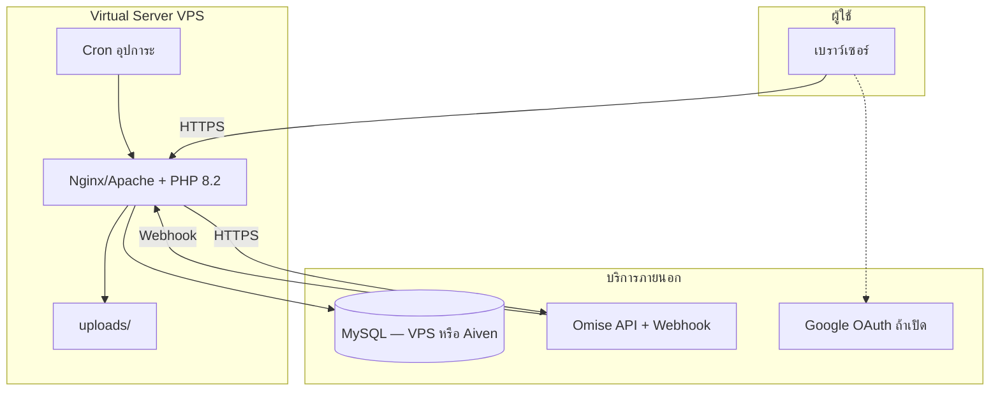

# คู่มือตอบคำถาม — Server Requirement / Virtual Server และการติดตั้ง–Config

เอกสารสำหรับเตรียมตอบอาจารย์ / รายงานจบ: อธิบาย **เซิร์ฟเวอร์ที่ใช้** และ **การติดตั้ง–ตั้งค่า** พร้อมอ้างอิง **ไฟล์ + เลขบรรทัดโค้ดจริง**

เอกสารที่เกี่ยวข้อง: [`drawdream-flow-walkthrough.md`](drawdream-flow-walkthrough.md) · [`includes-flow-walkthrough.md`](includes-flow-walkthrough.md) · [`README.md`](../README.md)

---

## สารบัญ

| ข้อ | หัวข้อ |
|-----|--------|
| **1** | Server Requirement หรือ Virtual Server ที่นศ. ใช้ |
| **2** | การติดตั้งและ Config ค่าต่างๆ เพื่อให้ระบบทำงานได้ |

---

# ข้อ 1 — Server Requirement หรือ Virtual Server ที่นศ. ใช้

## 1.1 ระบบเราคืออะไร

DrawDream เป็น **Web Application (เว็บแอปพลิเคชัน)** — ผู้ใช้เข้าผ่าน **เบราว์เซอร์** (มือถือ/คอม) ไม่ใช่แอป Android/iOS แยก

| ชั้น | เทคโนโลยี | บทบาท |
|------|-----------|--------|
| ฝั่งผู้ใช้ | HTML + CSS + JavaScript ในหน้า PHP | แสดงฟอร์ม, ปุ่มบริจาค, อัปโหลดรูป |
| ฝั่งเซิร์ฟเวอร์ | **PHP 8.x** | ประมวลผล login, บริจาค, อนุมัติ, แจ้งเตือน |
| ฐานข้อมูล | **MySQL 8** | เก็บเด็ก, โครงการ, สิ่งของ, `donation`, ฯลฯ |
| ชำระเงิน | **Omise** (คลาวด์) | QR PromptPay, บัตร, อุปการะรายรอบ |
| ไฟล์ | โฟลเดอร์ `uploads/` บนเซิร์ฟเวอร์ | รูปโปรไฟล์, หลักฐาน, ผลลัพธ์ |

จุดเชื่อมกลางของทุกหน้าที่ใช้ DB คือ `db.php` — ไฟล์นี้ถูก `include` จากหน้าเว็บเกือบทั้งหมด

---

## 1.2 Server Requirement คืออะไร (ทำไมต้องกำหนดก่อนเช่า VPS)

**Server Requirement** = รายการสเปกที่ทีม **กำหนดล่วงหน้า** ว่าเครื่องต้องมี CPU/RAM, ซอฟต์แวร์อะไร จึงจะรันเว็บ DrawDream ได้ครบ

จากนั้นทีมจึงไป **เช่า Virtual Server (VPS)** หรือ **Web Hosting** ที่สเปกตรงตาม Requirement แล้วติดตั้งโค้ดให้คนทั่วไปเข้าผ่านอินเทอร์เน็ต

---

## 1.3 ตาราง Server Requirement ของโปรเจกต์ DrawDream

| รายการ | ขั้นต่ำ (เดโม/ทดสอบ) | แนะนำ (เปิดให้คนใช้จริง) | อ้างอิงในโค้ด/ระบบ |
|--------|----------------------|---------------------------|-------------------|
| **ประเภท** | Web Application PHP + MySQL | เหมือนกัน | โครงสร้าง repo ทั้งหมด |
| **vCPU** | 1 core | **2 vCPU** | PHP ต่อ request + อัปโหลดรูป |
| **RAM** | 1 GB | **2 GB** (ถ้า MySQL บน VPS เดียวกัน → 4 GB) | PHP-FPM + MySQL |
| **Storage** | 20 GB SSD | **40 GB SSD** | `uploads/` เติบโต |
| **OS** | Ubuntu 22.04 LTS | Ubuntu 22.04 LTS | มาตรฐาน VPS |
| **PHP** | 8.1+ | **8.2** | `declare(strict_types=1)` ใน `db.php` บรรทัด 14 |
| **Web server** | — | Nginx + PHP-FPM หรือ Apache + PHP | Production |
| **PHP extensions** | mysqli, mbstring, openssl, curl, fileinfo | เหมือนกัน | `run_dev_server.ps1` บรรทัด 47–56 |
| **MySQL** | 8.0 / MariaDB 10.6+ | MySQL 8.0 | `mysqli` ใน `db.php` บรรทัด 48–89 |
| **Charset** | utf8mb4 | utf8mb4 | `db.php` บรรทัด 89 |
| **Timezone** | Asia/Bangkok (+07:00) | เหมือนกัน | `db.php` บรรทัด 96–97 |
| **HTTPS** | แนะนำ | **บังคับ** | Omise, webhook, OAuth |
| **Cron** | — | วันละครั้งหรือทุก 1–6 ชม. | `cron_child_subscription_charges.php` |
| **Outbound HTTPS** | เปิด | เปิด | `OMISE_API_URL` ใน `payment/config.php` บรรทัด 34 |

---

## 1.4 Virtual Server (VPS) ที่นศ. ใช้ — หน้าที่บนเครื่อง

**Virtual Server (VPS)** = เครื่องเซิร์ฟเวอร์เสมือนที่เช่าจากผู้ให้บริการ ได้ CPU/RAM/Disk ตามแพ็กเกจ ทีมติดตั้ง PHP + Web server เอง

บน VPS ของ DrawDream ทำหน้าที่:

1. รับ HTTPS จากผู้ใช้ → รันไฟล์ PHP (`login.php`, `children_donate.php`, `payment/*`)
2. เชื่อม **MySQL** (บน VPS หรือแยกคลาวด์ เช่น Aiven)
3. เรียก **Omise API** ออกไป (`https://api.omise.co`)
4. รับ **Webhook** จาก Omise ที่ `payment/omise_webhook.php`
5. รัน **Cron** หักอุปการะรอบถัดไป
6. เก็บรูปใน `uploads/`



---

## 1.5 บริการภายนอก (ไม่ใช่ CPU/RAM ของ VPS แต่ระบบต้องใช้)

| บริการ | หน้าที่ | ไม่ติดตั้งบน VPS |
|--------|--------|------------------|
| **Omise** | ชำระเงิน, QR, บัตร, schedule | ใช้ API ผ่าน HTTPS |
| **Aiven MySQL** (ทางเลือก) | DB บนคลาวด์ | โค้ด default ชี้ aivencloud ใน `db.php` บรรทัด 33–38 |
| **Google OAuth** (ทางเลือก) | Login ด้วย Google | `includes/google_oauth.php` |
| **โดเมน + SSL** | URL สาธารณะ | Let's Encrypt บน VPS |

---

## 1.6 สองสภาพแวดล้อมที่ทีมใช้

| สภาพแวดล้อม | อุปกรณ์/บริการ | ไฟล์ในโปรเจกต์ |
|-------------|----------------|-----------------|
| **พัฒนา (Local)** | เครื่องนศ. + XAMPP หรือ PHP | `run_dev_server.ps1` / `run_dev_server.bat` |
| **Production** | VPS ตาม Requirement | อัปโหลดโค้ด + config + SSL + cron |

**หมายเหตุ:** PHP built-in server (`php -S`) ใน `run_dev_server.ps1` บรรทัด 74 — ใช้ **เฉพาะพัฒนา** ไม่ใช่ production

---

## 1.7 ทำไมไม่ใช้โฮสต์ฟรี (เช่น InfinityFree) เป็นหลัก

| ความต้องการ DrawDream | โฮสต์ฟรีมักมีปัญหา |
|----------------------|-------------------|
| Cron อุปการะ | ไม่มีหรือจำกัด |
| Webhook Omise เสถียร | traffic / sleep |
| MySQL ภายนอก (Aiven) | บล็อก remote DB |
| PHP 8.2 + curl/openssl | จำกัดเวอร์ชัน/extension |

**สรุปข้อ 1:** ทีมกำหนด Requirement เป็น **VPS ~2 GB RAM, PHP 8.2, MySQL 8, HTTPS, Cron** แล้วเช่า VPS ตามสเปก — ระบบเป็น **เว็บ PHP** ไม่ใช่แอปมือถือแยก backend

---

# ข้อ 2 — การติดตั้งและ Config ค่าต่างๆ เพื่อให้ระบบทำงานได้

## 2.1 ภาพรวม: ลำดับการติดตั้ง

```
1) ติดตั้ง PHP + MySQL (หรือใช้ Aiven)
2) วางโค้ด DrawDream บนเซิร์ฟเวอร์
3) สร้างไฟล์ config (db.local.php, .env, payment/config.php)
4) ตั้งสิทธิ์โฟลเดอร์ uploads/, config/, data/
5) ตั้ง Omise (คีย์ + Webhook บน Dashboard)
6) ตั้ง Cron อุปการะ (ถ้าใช้โหมด local_cron)
7) เปิด HTTPS + ทดสอบ login / บริจาค
```

คู่มือสั้นใน [`README.md`](../README.md) บรรทัด 5–12

---

## 2.2 แผนที่ไฟล์ Config ทั้งหมด

| ลำดับโหลด | ไฟล์ | หน้าที่ | Git |
|-----------|------|--------|-----|
| 1 | `.env` | รหัสลับ, DB, OAuth, Webhook secret | ไม่ commit (`.gitignore` บรรทัด 15) |
| 2 | `includes/env_loader.php` | อ่าน `.env` → `getenv()` | commit |
| 3 | `config/db.local.php` | ค่า MySQL แบบ array | ไม่ commit (`.gitignore` บรรทัด 5) |
| 4 | `db.php` | เชื่อม DB + migration + timezone | commit |
| 5 | `payment/config.php` | Omise keys, cron secret, mock | commit (ควรย้าย secret ออก production) |
| 6 | `config/google_oauth.local.php` | Google client_id/secret | ไม่ commit (`.gitignore` บรรทัด 6) |
| 7 | `includes/google_oauth.php` | อ่าน OAuth config | commit |

---

## 2.3 Config ฐานข้อมูล — `db.php`

### 2.3.1 โหลด environment ก่อนเชื่อม DB

```15:16:db.php
require_once __DIR__ . '/includes/env_loader.php';
drawdream_load_env_file(__DIR__ . '/.env');
```

ฟังก์ชัน `drawdream_load_env_file` ใน `includes/env_loader.php`:

```12:22:includes/env_loader.php
    function drawdream_load_env_file(?string $envPath = null): void
    {
        static $loaded = false;
        if ($loaded) {
            return;
        }
        $loaded = true;

        $path = $envPath ?: (__DIR__ . '/../.env');
        if (!is_file($path)) {
            return;
        }
```

การ parse `KEY=VALUE` และใส่ `putenv` — บรรทัด 29–54 ของไฟล์เดียวกัน

**ตัวอย่าง `.env` (สร้างที่รากโปรเจกต์ ไม่ commit):**

```env
DB_HOST=localhost
DB_PORT=3306
DB_USER=root
DB_PASSWORD=รหัสผ่าน
DB_NAME=drawdream_db

# หรือ Aiven
# AIVEN_HOST=xxx.aivencloud.com
# AIVEN_PORT=21503
# AIVEN_USER=avnadmin
# AIVEN_PASSWORD=...
# AIVEN_DB=defaultdb
# DB_SSL_CA=C:/path/to/ca.pem

OMISE_PUBLIC_KEY=pkey_test_...
OMISE_SECRET_KEY=skey_test_...
OMISE_API_URL=https://api.omise.co
OMISE_WEBHOOK_SECRET=whsec_จาก_Omise_Dashboard
DRAWDREAM_SUBSCRIPTION_CRON_SECRET=สุ่มด้วย_openssl_rand_hex_32
OMISE_TEST_AUTO_MARK_PAID=true
GOOGLE_CLIENT_ID=...
GOOGLE_CLIENT_SECRET=...
GOOGLE_REDIRECT_URI=https://โดเมน/auth/google_callback.php
```

---

### 2.3.2 ลำดับอ่านค่า MySQL

คอมเมนต์อธิบายลำดับ — `db.php` บรรทัด 7–10:

```7:10:db.php
 * ค่าการเชื่อมต่ออ่านจาก (ตามลำดับ):
 * 1) ไฟล์ config/db.local.php (แนะนำ — สำเนาจาก config/db.local.example.php)
 * 2) ตัวแปรสภาพแวดล้อม DB_HOST, DB_PORT, DB_USER, DB_PASSWORD, DB_NAME
 * 3) ค่าเริ่มต้นแบบ XAMPP เดิม (root ไร้รหัส + drawdream_db)
```

โค้ดเลือกแหล่ง config:

```23:46:db.php
$dbLocalFile = __DIR__ . '/config/db.local.php';
if (is_file($dbLocalFile)) {
    /** @var array{host:string,port?:int,user:string,password:string,database:string} $dbConfig */
    $dbConfig = require $dbLocalFile;
} else {
    $envPass = getenv('DB_PASSWORD');
    if ($envPass === false || $envPass === '') {
        $envPass = getenv('AIVEN_PASSWORD');
    }
    $dbConfig = [
        // ค่า default สำหรับ Aiven Cloud (override ได้ด้วย env vars)
        'host' => getenv('DB_HOST') ?: (getenv('AIVEN_HOST') ?: 'mysql-17ffeb44-drawdream.c.aivencloud.com'),
        'port' => (int)(getenv('DB_PORT') ?: (getenv('AIVEN_PORT') ?: 21503)),
        'user' => getenv('DB_USER') ?: (getenv('AIVEN_USER') ?: 'avnadmin'),
        'password' => $envPass !== false && $envPass !== '' ? (string)$envPass : '',
        'database' => getenv('DB_NAME') ?: (getenv('AIVEN_DB') ?: 'defaultdb'),
    ];
}

$host = (string)($dbConfig['host'] ?? 'localhost');
$port = (int)($dbConfig['port'] ?? 3306);
$user = (string)($dbConfig['user'] ?? 'root');
$password = (string)($dbConfig['password'] ?? '');
$database = (string)($dbConfig['database'] ?? 'drawdream_db');
```

**ตัวอย่าง `config/db.local.php` (สร้างมือ ไม่ commit):**

```php
<?php
return [
    'host' => 'localhost',
    'port' => 3306,
    'user' => 'root',
    'password' => 'รหัสผ่าน',
    'database' => 'drawdream_db',
];
```

---

### 2.3.3 เชื่อม MySQL + SSL (Aiven)

```48:79:db.php
if (function_exists('mysqli_init') && function_exists('mysqli_real_connect')) {
    $connInit = mysqli_init();
    // ...
    $sslCa = trim((string)(getenv('DB_SSL_CA') !== false ? getenv('DB_SSL_CA') : ''));
    $sslMode = strtolower(trim((string)(getenv('DB_SSL_MODE') !== false ? getenv('DB_SSL_MODE') : 'require')));
    $useSsl = ($sslMode !== 'disable') || str_contains($host, 'aivencloud.com');
    // mysqli_ssl_set / mysqli_real_connect ...
    if (!$connOk) {
        $hint = $password === '' ? ' (DB_PASSWORD/AIVEN_PASSWORD ยังว่าง)' : '';
        die('Connection failed: ' . htmlspecialchars(mysqli_connect_error(), ENT_QUOTES, 'UTF-8') . $hint);
    }
```

ถ้ารหัสผ่านว่าง ข้อความ error จะบอกให้ใส่ `DB_PASSWORD` / `AIVEN_PASSWORD`

---

### 2.3.4 Charset และเวลาไทย

```89:97:db.php
mysqli_set_charset($conn, 'utf8mb4');

/*
 * เวลาในตารางและฟังก์ชันเช่น NOW(): ใช้เขตไทยเท่านั้น
 */
date_default_timezone_set('Asia/Bangkok');
@mysqli_query($conn, "SET time_zone = '+07:00'");
```

---

### 2.3.5 Migration อัตโนมัติ (ติดตั้ง schema โดยไม่รัน SQL มือทุกครั้ง)

```99:122:db.php
require_once __DIR__ . '/includes/drawdream_project_status.php';
require_once __DIR__ . '/includes/admin_audit_migrate.php';
require_once __DIR__ . '/includes/drawdream_soft_delete.php';
require_once __DIR__ . '/includes/drawdream_needlist_schema.php';
require_once __DIR__ . '/includes/drawdream_project_updates_schema.php';
require_once __DIR__ . '/includes/notification_audit.php';

// Migration cache — รันแค่ครั้งแรกหรือทุก 1 ชั่วโมง
$_ddMigrationCache = __DIR__ . '/config/migration_done.txt';
$_ddMigrationTtl   = 3600; // วินาที
$_ddNeedMigration  = !file_exists($_ddMigrationCache)
    || (time() - (int)filemtime($_ddMigrationCache)) > $_ddMigrationTtl;

if ($_ddNeedMigration) {
    drawdream_normalize_foundation_project_statuses($conn);
    drawdream_ensure_admin_audit_table($conn);
    drawdream_admin_deduplicate_entity_rows($conn);
    drawdream_ensure_soft_delete_columns($conn);
    drawdream_ensure_needlist_schema($conn);
    drawdream_ensure_foundation_project_update_columns($conn);
    drawdream_notifications_migrate_legacy_on_boot($conn);

    @file_put_contents($_ddMigrationCache, date('Y-m-d H:i:s'));
}
```

**ข้อกำหนดเซิร์ฟเวอร์:** โฟลเดอร์ `config/` ต้อง **เขียนได้** เพื่อสร้าง `migration_done.txt` (ไฟล์นี้อยู่ใน `.gitignore` บรรทัด 27)

---

## 2.4 Config ชำระเงิน Omise — `.env` + `payment/config.php`

ไฟล์ `payment/config.php` โหลด `.env` ผ่าน `includes/env_loader.php` แล้ว `define()` ค่าจาก environment — **ไม่เก็บคีย์ลับใน Git**

ตัวอย่าง: คัดลอก `.env.example` → `.env` ที่รากโปรเจกต์

### 2.4.1 คีย์ API และ URL

| ตัวแปร `.env` | ความหมาย |
|---------------|----------|
| `OMISE_PUBLIC_KEY` | Public key จาก Omise Dashboard |
| `OMISE_SECRET_KEY` | Secret key (ห้ามเปิดเผย) |
| `OMISE_API_URL` | ค่าเริ่มต้น `https://api.omise.co` |
| `pkey_test_` / `skey_test_` | โหมดทดสอบ — ไม่ตัดเงินจริง |
| Production | ใช้คีย์ **Live** ใน env บนโฮสต์เท่านั้น |

---

### 2.4.2 ใบรับรอง SSL สำหรับเรียก Omise

```36:44:payment/config.php
if (!defined('OMISE_CURL_CAINFO')) {
    foreach ([dirname(__DIR__) . '/payment/cacert.pem', dirname(__DIR__) . '/config/cacert.pem'] as $caPath) {
        if (is_file($caPath)) {
            define('OMISE_CURL_CAINFO', $caPath);
            break;
        }
    }
}
```

---

### 2.4.3 โหมด Mock (เฉพาะ dev)

```46:56:payment/config.php
if (!defined('OMISE_ALLOW_LOCAL_MOCK')) {
    define('OMISE_ALLOW_LOCAL_MOCK', false);
}
// ...
if (!defined('OMISE_TEST_MOCK_WHEN_HTTPS_FAILS')) {
    define('OMISE_TEST_MOCK_WHEN_HTTPS_FAILS', false);
}
```

ตั้งเป็น `true` เฉพาะเมื่อ PHP ต่อ Omise ไม่ได้ — จะได้ QR จำลอง ไม่มีรายการใน Omise Dashboard

### 2.4.3b โหมดทดสอบ — จำลองชำระสำเร็จอัตโนมัติ (ค่าเริ่มต้นเปิด)

ใน `.env`: `OMISE_TEST_AUTO_MARK_PAID=true`

- ใช้ได้เฉพาะคีย์ **Test** (`pkey_test_` / `skey_test_`) — **ไม่มีผล**เมื่อใช้คีย์ Live บนโฮสจริง
- ผู้บริจาคกด **ยืนยันการชำระ** หรือ **เช็คอีกครั้ง** ระบบเรียก Omise `mark_as_paid` ให้เอง (ไม่ต้องเข้า Dashboard)
- ตั้งเป็น `false` ถ้าต้องการทดสอบแบบเดิม (Mark as paid ใน Dashboard เอง)
- โฮสจริงที่รับเงินจริง: ใช้คีย์ Live + ตั้ง **Webhook** (`payment/omise_webhook.php`, `OMISE_WEBHOOK_SECRET`)

---

### 2.4.4 Secret สำหรับ Cron อุปการะ (HTTP)

ใน `.env`: `DRAWDREAM_SUBSCRIPTION_CRON_SECRET=` (สุ่มยาว เช่น `openssl rand -hex 32`)

คำแนะนำ cron:

- CLI: `php payment/cron_child_subscription_charges.php`
- HTTP: `https://โดเมน/payment/cron_child_subscription_charges.php?secret=ค่าด้านบน`
- Windows: `payment/run_subscription_cron.bat`

---

## 2.5 Webhook Omise — `payment/omise_webhook.php` + `.env`

### 2.5.1 ตั้งบน Omise Dashboard (นอกโค้ด)

คอมเมนต์หัวไฟล์ บรรทัด 5–8:

```5:8:payment/omise_webhook.php
 * ตั้งค่า: Omise Dashboard (Test/Live) → Webhooks → ใส่ URL แบบ HTTPS
 * (บน localhost ใช้ ngrok ชี้มาที่ .../payment/omise_webhook.php)
 * เลือก event ที่เกี่ยวกับ charge (อย่างน้อย charge.complete)
```

### 2.5.2 ตรวจลายเซ็น webhook

```77:91:payment/omise_webhook.php
function drawdream_webhook_verify_signature_and_time(string $rawBody): bool
{
    $secret = trim((string)(getenv('OMISE_WEBHOOK_SECRET') ?: ''));
    if ($secret === '') {
        error_log('[drawdream_webhook] OMISE_WEBHOOK_SECRET is not configured — rejecting webhook');
        return false;
    }
    $sig = drawdream_webhook_get_header('X-Omise-Signature');
    // ...
    $expected = hash_hmac('sha256', $rawBody, $secret);
    if (!hash_equals($expected, strtolower($sig))) {
        error_log('[drawdream_webhook] signature mismatch');
        return false;
    }
```

ใส่ใน `.env`: `OMISE_WEBHOOK_SECRET=...` จาก Omise Dashboard (**บังคับบน production** — ถ้าไม่ตั้ง webhook จะถูกปฏิเสธ HTTP 400)

ตั้ง `APP_ENV=production` ใน `.env` เพื่อปิด `display_errors` ทุกหน้าที่โหลด `db.php`

### 2.5.3 โฟลเดอร์ `data/` สำหรับกันส่งซ้ำ

```27:29:payment/omise_webhook.php
function drawdream_webhook_event_seen_path(): string
{
    return dirname(__DIR__) . '/data/omise_webhook_seen.json';
}
```

เซิร์ฟเวอร์ต้อง **สร้างและเขียน** โฟลเดอร์ `data/` ได้

---

## 2.6 Google Login — `includes/google_oauth.php`

### 2.6.1 อ่าน config

```26:44:includes/google_oauth.php
function drawdream_google_oauth_config(): array
{
    $configFile = __DIR__ . '/../config/google_oauth.local.php';
    if (is_file($configFile)) {
        $cfg = require $configFile;
    } else {
        $cfg = [
            'client_id' => getenv('GOOGLE_CLIENT_ID') ?: '',
            'client_secret' => getenv('GOOGLE_CLIENT_SECRET') ?: '',
            'redirect_uri' => getenv('GOOGLE_REDIRECT_URI') ?: '',
        ];
    }

    return [
        'client_id' => trim((string)($cfg['client_id'] ?? '')),
        'client_secret' => trim((string)($cfg['client_secret'] ?? '')),
        'redirect_uri' => trim((string)($cfg['redirect_uri'] ?? '')),
    ];
}
```

### 2.6.2 เช็กว่าตั้งค่าครบ

```50:54:includes/google_oauth.php
function drawdream_google_oauth_is_ready(): bool
{
    $cfg = drawdream_google_oauth_config();
    return $cfg['client_id'] !== '' && $cfg['client_secret'] !== '' && $cfg['redirect_uri'] !== '';
}
```

### 2.6.3 จุดเริ่ม login

`auth/google_start.php` บรรทัด 11–14 — ถ้า config ไม่ครบ redirect กลับ login พร้อม error

`auth/google_callback.php` บรรทัด 9–18 — รับ code จาก Google หลังผู้ใช้อนุญาต

---

## 2.7 Cron อุปการะรายรอบ — `payment/cron_child_subscription_charges.php`

### 2.7.1 ป้องกันการเรียก HTTP โดยไม่มี secret

```6:16:payment/cron_child_subscription_charges.php
if (PHP_SAPI !== 'cli') {
    require_once __DIR__ . '/config.php';
    $sec = defined('DRAWDREAM_SUBSCRIPTION_CRON_SECRET') ? (string)DRAWDREAM_SUBSCRIPTION_CRON_SECRET : '';
    if ($sec === '' || !isset($_GET['secret']) || !hash_equals($sec, (string)$_GET['secret'])) {
        http_response_code(403);
        header('Content-Type: text/plain; charset=utf-8');
        echo 'Forbidden';
        exit;
    }
    header('Content-Type: text/plain; charset=utf-8');
}
```

### 2.7.2 โหลด DB และหักรอบ

```18:24:payment/cron_child_subscription_charges.php
require_once dirname(__DIR__) . '/db.php';
require_once __DIR__ . '/config.php';
require_once dirname(__DIR__) . '/includes/omise_api_client.php';
require_once dirname(__DIR__) . '/includes/child_omise_subscription.php';
require_once dirname(__DIR__) . '/includes/child_sponsorship.php';
require_once dirname(__DIR__) . '/includes/e_receipt.php';
```

### 2.7.3 สคริปต์ Windows Task Scheduler

`payment/run_subscription_cron.bat` บรรทัด 1–6:

```bat
@echo off
REM ใช้กับ Windows Task Scheduler: รันวันละครั้งหรือทุก 1-6 ชม.
set PHP_EXE=C:\xampp\php\php.exe
"%PHP_EXE%" "%~dp0cron_child_subscription_charges.php"
```

---

## 2.8 ติดตั้งและรันบนเครื่องพัฒนา (Local)

### 2.8.1 `run_dev_server.ps1`

| บรรทัด | การทำงาน |
|--------|----------|
| 13–20 | หา `php.exe` จาก XAMPP หรือ PATH |
| 28–33 | map `AIVEN_*` → `DB_*` |
| 35–39 | ค่า default โฮสต์ DB ถ้ายังไม่ตั้ง env |
| 47–57 | โหลด extension mysqli, curl, openssl ฯลฯ ถ้ายังไม่มี |
| 60, 74 | เปิด `http://127.0.0.1:8080/login.php` และรัน `php -S` |

```60:74:run_dev_server.ps1
$url = "http://127.0.0.1:$Port/login.php"
// ...
& $phpExe @extArgs -S "127.0.0.1:$Port" -t $root
```

### 2.8.2 `run_dev_server.bat`

ตรวจ extension บรรทัด 36–38, เปิดเบราว์เซอร์บรรทัด 51, รัน server บรรทัด 53

---

## 2.9 ติดตั้งบน VPS (Production) — checklist

| ขั้น | รายการ | อ้างอิง config |
|------|--------|----------------|
| 1 | ติดตั้ง Nginx/Apache + **PHP 8.2** + extensions | ข้อ 1.3 |
| 2 | อัปโหลดโค้ด → document root = รากที่มี `index.php`, `homepage.php` | `index.php` redirect → `homepage.php` |
| 3 | สร้าง `config/db.local.php` หรือตั้ง env บน VPS | `db.php` 23–46 |
| 4 | ตั้ง `payment/config.php` คีย์ Omise **Live** | บรรทัด 32–34 |
| 5 | สร้าง `.env` → `OMISE_WEBHOOK_SECRET` | `omise_webhook.php` 79 |
| 6 | ตั้ง Omise Dashboard → Webhook URL | `omise_webhook.php` 5–8 |
| 7 | ตั้ง Cron / Task Scheduler | `config.php` 21–27, `cron_*.php` 6–16 |
| 8 | `chmod` ให้ `uploads/`, `config/`, `data/` เขียนได้ | `.gitignore` 2, 27 |
| 9 | ติดตั้ง SSL (Let's Encrypt) | Requirement HTTPS |
| 10 | ทดสอบ login → บริจาค → ใบเสร็จ | `includes/e_receipt.php` |

---

## 2.10 สิ่งที่ต้องตั้งบนเซิร์ฟเวอร์แต่ไม่มีในไฟล์ config เดียว

| รายการ | เหตุผล |
|--------|--------|
| โฟลเดอร์ `uploads/` writable | อัปโหลดรูปเด็ก/โครงการ/หลักฐาน |
| PHP `upload_max_filesize` / `post_max_size` | รูปหลักฐานสูงสุด ~4MB ต่อไฟล์ในหลายหน้า |
| Omise: ยืนยันอีเมลบัญชี | Charge Schedule — คอมเมนต์ `payment/config.php` 10–11 |
| TCPDF (ถ้าใช้ PDF แอดมิน) | `README.md` บรรทัด 14–16, `tools/install_tcpdf.ps1` |

---

## 2.11 ตารางสรุปอ้างอิงไฟล์–บรรทัด (Config)

| หัวข้อ | ไฟล์ | บรรทัดสำคัญ |
|--------|------|-------------|
| โหลด .env | `db.php` | 15–16 |
| ฟังก์ชันโหลด .env | `includes/env_loader.php` | 12–55 |
| Config MySQL | `db.php` | 23–46, 54–64, 89–97 |
| Migration อัตโนมัติ | `db.php` | 99–122 |
| คีย์ Omise | `payment/config.php` | 32–34 |
| SSL Omise | `payment/config.php` | 36–44 |
| Mock Omise | `payment/config.php` | 46–56 |
| Cron secret | `payment/config.php` | 58–63 |
| Webhook verify | `payment/omise_webhook.php` | 77–91 |
| Google OAuth | `includes/google_oauth.php` | 26–54 |
| Cron HTTP guard | `payment/cron_child_subscription_charges.php` | 6–16 |
| Dev server | `run_dev_server.ps1` | 28–39, 60, 74 |
| ไฟล์ไม่ commit | `.gitignore` | 2, 5–6, 15, 27 |

---

## ประโยคสรุปตอบปาก (ทั้ง 2 ข้อ)

**ข้อ 1:** โปรเจกต์ DrawDream เป็นเว็บ PHP + MySQL เรากำหนด Server Requirement เป็น VPS ประมาณ 2 GB RAM, PHP 8.2, MySQL 8, HTTPS และ Cron จากนั้นเช่า Virtual Server ตามสเปกนั้นเพื่อรันโค้ดให้ผู้ใช้เข้าผ่านเบราว์เซอร์ ส่วน Omise เป็นบริการภายนอก

**ข้อ 2:** การติดตั้งเริ่มจากวางโค้ดและตั้งค่าใน `db.php` (เชื่อม DB จาก `config/db.local.php` หรือ `.env` บรรทัด 15–46), `payment/config.php` (Omise บรรทัด 32–63), webhook ที่ `payment/omise_webhook.php` (secret จาก `.env` บรรทัด 79), cron อุปการะ, และสิทธิ์เขียน `uploads/` — schema ส่วนใหญ่อัปเดตอัตโนมัติที่ `db.php` บรรทัด 106–122

---

*อัปเดตตามโค้ดใน repo DrawDream — ใช้คู่กับ [`drawdream-flow-walkthrough.md`](drawdream-flow-walkthrough.md)*
